# Retail Omni-Channel Customer Loyalty & Rewards Management System

**SAP BTP CAP (CAPM) Capstone Project — AASE QC Final Round**

| | |
|---|---|
| **Stack** | SAP CAP (Node.js) · CDS · OData v4 · SAP Fiori UI5 · SAP HANA Cloud · SAP BAS + Build Code (Joule) · SAP BTP Cloud Foundry · XSUAA |
| **Roles** | Customer · Retail Staff · Admin |
| **Entities** | Customer · Transaction · Redemption (+ RewardPolicy, TierThreshold configuration) |
| **Live application** | <https://9231c958trial-dev-loyalty-rewards.cfapps.us10-001.hana.ondemand.com/loyaltydashboard/index.html> |
| **Live CRUD test harness** | <https://9231c958trial-dev-loyalty-rewards.cfapps.us10-001.hana.ondemand.com/apitestharness/index.html> |
| **Report date** | 2026-08-16 |

> **Converting this file to Word:** all figures are embedded as PNGs with paths relative to this file. The cleanest route is Pandoc:
> `pandoc docs/capstone-report.md -o report.docx --resource-path=docs --toc`
> or open the file in VS Code preview and paste across — tables and images carry over intact. Mermaid diagram *sources* are kept in Appendix B; the diagrams themselves are already rendered as images (Figures 1.1, 2.1, 3.1, 4.1, 6.1).

---

## Contents

1. [Project Overview](#1-project-overview)
2. [Data Model Design](#2-data-model-design)
3. [Service Definition & Business Logic](#3-service-definition--business-logic)
4. [Agile Sprint Plan](#4-agile-sprint-plan)
5. [Test Case Sheet](#5-test-case-sheet)
6. [Deployment Steps](#6-deployment-steps)
7. [Application Showcase — Executed Output](#7-application-showcase--executed-output)
8. [Build Code Prompts](#8-build-code-prompts)
9. [Conclusion & Learning Outcomes](#9-conclusion--learning-outcomes)
- [Appendix A — Requirements Coverage](#appendix-a--requirements-coverage)
- [Appendix B — Diagram Sources](#appendix-b--diagram-sources)
- [Appendix C — Design-to-Code Trail](#appendix-c--design-to-code-trail)
- [Appendix D — Project Structure](#appendix-d--project-structure)

---

# 1. Project Overview

## 1.1 Introduction

This system unifies online and in-store retail purchases into one loyalty program: a single customer record, one points balance, channel-specific earn rates that an admin can change at runtime, and redemptions that are validated so a balance can never go below zero. It was built with SAP CAP on Node.js, exposed as OData v4, fronted by Fiori UI5 apps for three roles, and deployed to SAP BTP Cloud Foundry with SAP HANA Cloud as the production database.

## 1.2 Background — why omni-channel loyalty is a real problem

A retailer that runs both an e-commerce site and physical outlets typically ends up with two disconnected reward stories: points earned online cannot be spent at the counter, balances drift, and nobody — least of all the customer — trusts the number. The business also wants the reward rate to be a lever (earn more online to push digital adoption), which means rates are configuration, not code. Finally, points are a financial liability: the balance column must be protected against over-redemption, concurrent double-spend, and direct tampering through the API.

## 1.3 Objective

To develop a Loyalty & Rewards Management System that records customer transactions from Online and Store channels in one place, computes loyalty points dynamically from admin-configurable per-channel policies, derives tier membership from lifetime earning, and allows redemption through any channel with hard guarantees: sufficient-balance validation, atomic deduction, and a balance that never goes negative — all served through role-aware OData v4 APIs and Fiori UIs, and deployed end-to-end on SAP BTP.

## 1.4 Scope

| In Scope | Out of Scope |
|---|---|
| Purchase recording for Online and Store channels | Payment/card processing, invoicing |
| Dynamic points computation from per-channel policies (₹1 = 0.05 Online, 0.03 Store by default, admin-editable at runtime) | Multi-currency (₹ only) |
| Points redemption with balance validation and atomic deduction | Native mobile apps (responsive web only) |
| Points as **part-payment** during a purchase (1 pt = ₹0.50) | Points expiry / campaign management |
| Tier derivation from lifetime points, incl. recompute when thresholds change | Marketing campaign engine, BI integration |
| Role-based access: Customer self-service, Staff operations, Admin governance | HR/ERP/S4 integration |
| Admin CRUD on reward policies and tier thresholds | Full localization beyond a single i18n bundle |
| Fiori UI5: freestyle role dashboard + 4 generated admin apps + CRUD test harness | — |
| XSUAA authentication with role collections (basic-auth mock users in dev/test) | — |
| Deployment to BTP Cloud Foundry: HANA Cloud HDI, approuter, HTML5 repo | — |
| Automated backend tests (12) + interactive CRUD matrix (38 cases) | — |

## 1.5 Roles & functionalities

| Role | Functionality |
|---|---|
| **Customer** | Auto-onboards on first login; sees balance, tier, lifetime points; registers own purchases (Online/Store, optional points part-payment with a live preview); redeems points; tracks purchase and redemption history |
| **Retail Staff** | Finds a customer by email (identity + balance + tier **only** — no purchase history by design); records POS/Online purchases incl. points part-payment; onboards new customers; daily KPI tiles incl. *Purchases today* |
| **Admin** | Edits reward policies (points per ₹1 per channel) and tier thresholds — effective immediately, no redeploy; gated customer-360 lookup by email or UUID; program KPIs incl. *Outstanding points* (earned-but-unspent liability); full customer master list |

One deliberate decision worth stating up front: **staff can see who a customer is, but not what they bought.** The staff search returns identity and current balance (needed to accept points as payment) and nothing else. This is enforced on the backend with `@restrict` grants, not by hiding UI elements — the API refuses to hand out the data in the first place.

## 1.6 High-level system flow

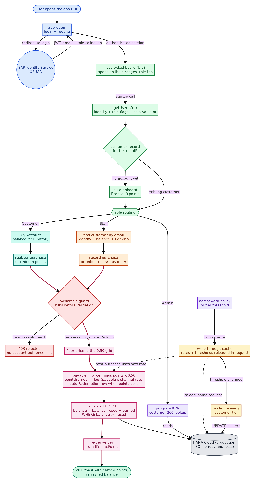

*Figure 1.1 — End-to-end flow: login at the blue edge, role routing into the three lanes (customer teal, staff orange, admin purple), everything converging on the red ownership guard, then the pink purchase engine in one database transaction. Amber is the only path that changes program rules, feeding the engine through a write-through cache.*

Reading it top to bottom: every request is authenticated at the approuter/XSUAA edge, the dashboard learns who it is serving from a single `getUserInfo()` call, the three role lanes converge on the ownership guard (403 before any validation runs), and anything that passes flows through the purchase engine — grid flooring, part-payment, points computation, atomic guarded balance update, tier derivation — inside one transaction. The admin lane changes rates and thresholds only through the cache, which reloads in the same request.

## 1.7 Technology stack

| Layer | Technology | Where used |
|---|---|---|
| UI | SAP Fiori UI5 (freestyle + generated List Report/Object Page) | `app/loyalty-dashboard`, 4 generated admin apps, `app/api-test-harness` |
| UI dev server | `cds-plugin-ui5` | UIs served by `cds watch` locally |
| Service | SAP CAP Node.js (`@sap/cds` v9), OData v4 | `srv/service.cds`, handlers in `srv/handlers/` |
| Domain model | CDS (`db/schema.cds`) | 5 entities, `managed` aspect, associations |
| Database | SQLite in-memory (dev/test) → SAP HANA Cloud HDI (prod, `@cap-js/hana`) | same CQN on both |
| Auth | XSUAA + role collections (prod); basic-auth mock users (dev/test) | `xs-security.json`, `package.json` profiles |
| Audit | `@cap-js/change-tracking` (`@changelog` on balances, tier, policies, thresholds) | object-page "Change History" facets |
| Build & deploy | CDS DK v9, `mbt` v1.2, BTP Cloud Foundry MTA, HTML5 app repo, approuter | `mta.yaml`, `.cdsrc.json` |
| AI assistance | SAP Build Code (Joule) — project scaffold, model, service, handlers, UI generation | prompt log in Section 8 |
| Testing | `node --test` + `@cap-js/cds-test`; interactive CRUD harness (plain fetch, deployed) | `test/loyalty.test.js`, `app/api-test-harness` |
| Environment | SAP Business Application Studio, Node.js ≥ 20 | — |

---

# 2. Data Model Design

## 2.1 Design decisions

The problem statement specifies three entities — Customer, Transaction, Redemption — and every specified attribute is present with its specified type (the conformance table in `docs/data-model.md` maps each one). Two things were added, both forced by requirements:

1. **Two configuration entities, `RewardPolicy` and `TierThreshold`.** The admin role in the spec must *define and modify* reward policies and tier rules. Hardcoding rates in a handler would make that impossible; storing them as data makes an admin's edit effective on the very next purchase with no redeploy.
2. **A spend/history split on Customer.** `totalPoints` is the spendable balance (drops on redemption), `lifetimePoints` is the never-decreasing earn counter that drives tiering. Without the split, a redemption would demote a Gold customer back to Bronze — wrong: tiers reward lifetime value, redemption is just spending what you earned.

On Transaction, `price` (list price) and `pointsApplied` (points put in as part-payment) were added so that the spec's `amount` keeps its honest meaning: the cash the customer actually pays. A purchase that applies points also writes an automatic `Redemption` row, so part-payments and standalone redemptions share one audit trail.

One more rule that shapes the whole model: **Transaction and Redemption are an append-only ledger.** No role has UPDATE or DELETE on either entity — fixes would be new rows, the normal choice for anything financial.

## 2.2 Entity-relationship diagram

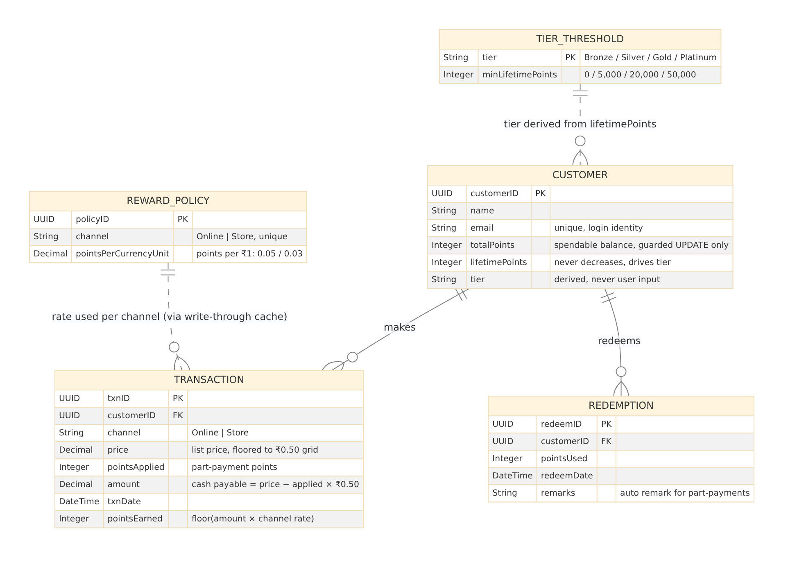

*Figure 2.1 — Data model. Solid crow's-foot: Customer 1—N Transaction, Customer 1—N Redemption. Dashed: the two configuration entities that parameterise every computation (policy per channel, threshold per tier).*

| Relationship | Cardinality | Meaning |
|---|---|---|
| Customer → Transaction | 1 : N | every purchase belongs to exactly one customer |
| Customer → Redemption | 1 : N | standalone redemptions **and** auto-written part-payment rows |
| RewardPolicy ⇢ Transaction | 1 : N (via channel) | earn rate applied per purchase — read through the write-through cache, never joined per purchase |
| TierThreshold ⇢ Customer | 1 : N | tier derived from `lifetimePoints` whenever points are earned or a threshold changes |

## 2.3 Entity definitions

### Customer

| Attribute | Type | Key | Source | Description |
|---|---|---|---|---|
| customerID | UUID | PK | spec | unique identifier |
| name | String(120) | | spec | full name (required, validated) |
| email | String(254) | | spec | login identity; unique — one account per email (409 on duplicates) |
| totalPoints | Integer, default 0 | | spec | spendable balance; moves **only** through guarded handler UPDATEs |
| lifetimePoints | Integer, default 0 | | extension | never decreases; drives tier promotion |
| tier | String(10), default 'Bronze' | | spec | derived server-side, never user input |
| transactions / redemptions | Association to many | | extension | navigations from the customer row |
| *(managed)* | — | | extension | createdAt / createdBy / modifiedAt / modifiedBy |

### Transaction

| Attribute | Type | Key | Source | Description |
|---|---|---|---|---|
| txnID | UUID | PK | spec | unique identifier |
| customerID | Association → Customer | FK | spec | owning customer |
| channel | String(10) enum { Online; Store } | | spec | purchase mode; runtime-validated (400 on anything else) |
| price | Decimal(10,2), default 0 | | extension | product list price; floored to the ₹0.50 grid by the service |
| pointsApplied | Integer, default 0 | | extension | reward points used as part-payment (each covers ₹0.50) |
| amount | Decimal(10,2) | | spec | **derived**: cash payable = price − pointsApplied × ₹0.50 |
| txnDate | DateTime | | spec | server-stamped |
| pointsEarned | Integer, default 0 | | spec | **derived**: floor(amount × channel policy rate) |

### Redemption

| Attribute | Type | Key | Source | Description |
|---|---|---|---|---|
| redeemID | UUID | PK | spec | unique identifier |
| customerID | Association → Customer | FK | spec | owning customer |
| pointsUsed | Integer | | spec | positive integer, ≤ balance (validated); never lets the balance go negative |
| redeemDate | DateTime | | spec | server-stamped |
| remarks | String(255) | | spec | free text; auto-filled `Applied to purchase (₹X → payable ₹Y)` for part-payments |

### RewardPolicy (configuration — extension)

| Attribute | Type | Key | Description |
|---|---|---|---|
| policyID | UUID | PK | internal key |
| channel | String(10) enum { Online; Store } | unique | one policy per channel (409 on duplicates) |
| pointsPerCurrencyUnit | Decimal(5,2) | | earn rate: points per ₹1 — seeded Online 0.05, Store 0.03 |

### TierThreshold (configuration — extension)

| Attribute | Type | Key | Description |
|---|---|---|---|
| tier | String(10) | PK | tier name |
| minLifetimePoints | Integer | | lifetime points at which the tier is reached — seeded Bronze 0, Silver 5,000, Gold 20,000; Platinum 50,000 was added live through the admin UI |

## 2.4 CDS schema (annotated)

`db/schema.cds`, complete and exactly as deployed:

```cds
using { managed } from '@sap/cds/common';

namespace loyalty;

entity Customer : managed {                    // managed → createdAt/By, modifiedAt/By audit columns
  key customerID   : UUID;
  name             : String(120);
  email            : String(254);              // RFC 5321 max length; uniqueness enforced in the handler (409)
  totalPoints      : Integer default 0;        // spendable balance — guarded UPDATE only, never user input
  lifetimePoints   : Integer default 0;        // never decreases → tiering survives redemptions
  tier             : String(10) default 'Bronze';
  transactions     : Association to many Transaction on transactions.customerID = $self;
  redemptions      : Association to many Redemption on redemptions.customerID = $self;
}

entity Transaction : managed {
  key txnID        : UUID;
  customerID       : Association to Customer;
  channel          : String(10) enum { Online; Store };  // documented in $metadata; enforced at runtime (400)
  // product list price entered at purchase time (₹0.50-denominated by the service)
  price            : Decimal(10,2) default 0;
  // reward points applied as part-payment (1 pt = POINT_VALUE_INR, see lib/point-value)
  pointsApplied    : Integer default 0;
  // cash payable after points: price − pointsApplied × point value
  amount           : Decimal(10,2);
  txnDate          : DateTime;
  pointsEarned     : Integer default 0;
}

entity Redemption : managed {
  key redeemID     : UUID;
  customerID       : Association to Customer;
  pointsUsed       : Integer;
  redeemDate       : DateTime;
  remarks          : String(255);
}

entity RewardPolicy : managed {                // configuration, not master data — admin-editable at runtime
  key policyID             : UUID;
  channel                  : String(10) enum { Online; Store };
  pointsPerCurrencyUnit    : Decimal(5,2);
}

entity TierThreshold : managed {
  key tier             : String(10);
  minLifetimePoints    : Integer;
}

annotate RewardPolicy with @assert.unique: { channel: [ channel ] };   // one policy per channel
```

## 2.5 Point & tier invariants (all enforced server-side)

| # | Invariant | Where enforced |
|---|---|---|
| 1 | `pointsEarned = floor(amount × rate(channel))` — rate from RewardPolicy via cache | transaction handler |
| 2 | `amount = price − pointsApplied × ₹0.50`, with `price` floored to the ₹0.50 grid → payable never carries an odd fraction | transaction handler |
| 3 | Balance changes are single atomic guarded UPDATEs (`… WHERE totalPoints >= used`) — never read-modify-write | both handlers |
| 4 | Balance can never go below zero (spec requirement) | guard + redemption validation |
| 5 | Tier is derived from `lifetimePoints` on every earn **and** re-derived for all customers when a threshold changes | transaction handler + policy handler |
| 6 | Redeeming never demotes a tier (lifetime counter is untouched by spends) | model split + handlers |
| 7 | Ledger is append-only: no PATCH/DELETE on Transactions/Redemptions for any role | `@restrict` matrix |

---

# 3. Service Definition & Business Logic

## 3.1 Service definition (annotated)

`srv/service.cds`, complete. One CAP service, five exposed entities, one function import, and the full role matrix expressed as `@restrict`:

```cds
using { loyalty } from '../db/schema';

@path: '/odata/v4/loyalty'
service LoyaltyService @(requires: 'authenticated-user') {   // nothing is public; anonymous → 401

  entity Customers      as projection on loyalty.Customer;
  entity Transactions   as projection on loyalty.Transaction;
  entity Redemptions    as projection on loyalty.Redemption;
  entity RewardPolicies as projection on loyalty.RewardPolicy;
  entity TierThresholds as projection on loyalty.TierThreshold;

  type UserInfo : {                                     // one round-trip: who am I + what are the rules
    id        : String;
    email     : String;
    name      : String;
    isAdmin   : Boolean;
    isStaff   : Boolean;
    isCustomer: Boolean;
    pointValueInr : Decimal(5,2);                       // ₹ value of one point — single source of truth
  };

  function getUserInfo() returns UserInfo;
}


annotate LoyaltyService.Customers with @(restrict: [
  { grant: 'READ', to: 'admin' },
  { grant: 'READ', to: 'staff' },
  { grant: ['READ', 'CREATE'], to: 'customer', where: 'email = $user.email' },  // own row only
  { grant: 'CREATE', to: 'staff' },                     // staff may onboard any customer
  { grant: 'CREATE', to: 'admin' }
]);

annotate LoyaltyService.Transactions with @(restrict: [
  { grant: ['READ', 'CREATE'], to: 'admin' },
  { grant: ['READ', 'CREATE'], to: 'staff' },
  { grant: 'READ', to: 'customer', where: 'customerID.email = $user.email' },  // own purchases only
  // customers may register purchases for their OWN account only
  // (enforced in srv/service.js — $user where-clauses don't apply to CREATE)
  { grant: 'CREATE', to: 'customer' }
]);

annotate LoyaltyService.Redemptions with @(restrict: [
  { grant: ['READ', 'CREATE'], to: 'admin' },
  { grant: ['READ', 'CREATE'], to: 'customer', where: 'customerID.email = $user.email' }
]);

annotate LoyaltyService.RewardPolicies with @(restrict: [
  { grant: '*', to: 'admin' },
  { grant: 'READ', to: 'staff' }                        // staff see rates (for hints), cannot change them
]);

annotate LoyaltyService.TierThresholds with @(restrict: [
  { grant: '*', to: 'admin' }
]);

// audit trail: every change to balances, tiers, rates and thresholds is tracked
annotate LoyaltyService.Customers {
  totalPoints    @changelog;
  lifetimePoints @changelog;
  tier           @changelog;
};
annotate LoyaltyService.RewardPolicies {
  pointsPerCurrencyUnit @changelog;
};
annotate LoyaltyService.TierThresholds {
  minLifetimePoints @changelog;
};
```

## 3.2 Exposed OData v4 endpoints

Service root: `http://localhost:4004/odata/v4/loyalty` locally, `/odata/v4/loyalty` behind the approuter in production. Writes require an `x-csrf-token` fetched with a prior GET.

| Endpoint | Backing entity | Operations by role |
|---|---|---|
| `/Customers` | `loyalty.Customer` | admin: read all, create · staff: read all, create · customer: read/create **own row** (own-email enforced) |
| `/Transactions` | `loyalty.Transaction` | admin, staff: read, create · customer: read own (row-level `where`), create for own account only |
| `/Redemptions` | `loyalty.Redemption` | admin: read, create · customer: read/create own · staff: **no access** (they see identity, not history) |
| `/RewardPolicies` | `loyalty.RewardPolicy` | admin: full CRUD · staff: read only |
| `/TierThresholds` | `loyalty.TierThreshold` | admin: full CRUD · everyone else: 403 |
| `/getUserInfo()` | function import | any authenticated user — identity, role flags, `pointValueInr` |

Standard OData v4 query features used by the UIs and the test harness: `$filter`, `$select`, `$top`, `$expand`, and `$apply=groupby((channel),aggregate(pointsEarned with sum as total))` for the KPI tiles.

## 3.3 Handler execution flow

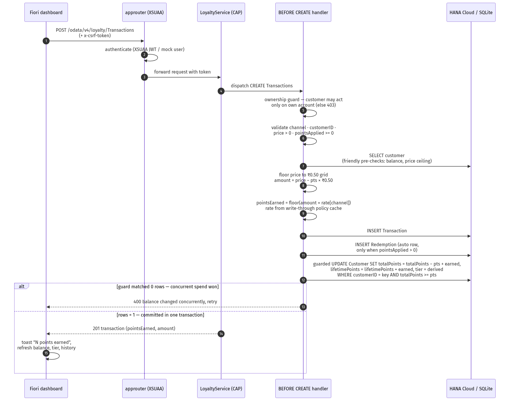

*Figure 3.1 — `POST /Transactions` end to end. Everything from validation to the balance UPDATE happens in **one** `before CREATE` handler and **one** database transaction, so a half-recorded purchase cannot exist.*

## 3.4 Handler A — `before CREATE` on Transactions (the points engine)

Core of `srv/handlers/transaction.js`:

```js
srv.before('CREATE', Transactions, async (req) => {
  await assertOwnCustomer(srv)(req)          // ownership FIRST (see 3.9) — 403 before validation
  // ... channel / customerID / price > 0 / pointsApplied >= 0 validation (400 with field target) ...

  // Denominate the price on the ₹0.50 grid so the payable never carries an
  // odd fraction: 1 point already covers exactly ₹0.50.
  const price = Math.floor(rawPrice * 2) / 2

  // ... customer lookup; friendly pre-checks: balance covers pointsApplied,
  //     pointsApplied <= floor(price / 0.50) ("points exceed purchase value") ...

  const amount = price - pointsApplied * POINT_VALUE_INR          // always a ₹0.50 multiple
  const rate = policyCache.rateFor(channel)                       // write-through cache, never a per-request DB hit
  const pointsEarned = Math.floor(amount * rate)

  req.data.price = price;  req.data.amount = amount;  req.data.pointsEarned = pointsEarned
  req.data.txnDate = req.data.txnDate || new Date().toISOString()

  // Part-payment: record the redemption side in the SAME transaction.
  // Plain INSERT targets cds.db directly — re-running the Redemptions handler
  // here would double-deduct the balance.
  if (pointsApplied > 0) {
    await INSERT.into(Redemptions).entries({
      customerID_customerID: customerKey, pointsUsed: pointsApplied,
      redeemDate: req.data.txnDate,
      remarks: `Applied to purchase (₹${price} → payable ₹${amount})`
    })
  }

  const newLifetimePoints = customer.lifetimePoints + pointsEarned
  const newTier = computeTier(newLifetimePoints, policyCache.getThresholds())

  // Concurrency backstop: single atomic UPDATE, computed by the database —
  // NOT a read-modify-write. The loser of a race matches 0 rows and gets 400.
  const rows = await UPDATE(Customers)
    .where({ customerID: customerKey })
    .and('totalPoints >=', pointsApplied)
    .set({
      totalPoints:    { xpr: [{ ref: ['totalPoints'] }, '-', { val: pointsApplied }, '+', { val: pointsEarned }] },
      lifetimePoints: { xpr: [{ ref: ['lifetimePoints'] }, '+', { val: pointsEarned }] },
      tier: newTier
    })
  if (rows !== 1) return req.reject(400, 'Insufficient points: balance changed concurrently, retry the purchase', 'pointsApplied')
})
```

**Validation table** (all verified in Section 5):

| Input problem | Response | Message (verbatim) |
|---|---|---|
| channel not Online/Store | 400 | `channel must be one of Online, Store` |
| missing/unknown customerID | 400 | `No customer found for <id>` |
| price ≤ 0 | 400 | `price must be greater than 0` |
| pointsApplied negative / non-integer | 400 | `pointsApplied must be a non-negative integer` |
| pointsApplied > balance | 400 | `Insufficient points: customer has N, tried to apply M` |
| pointsApplied > price / 0.50 | 400 | `Points exceed purchase value: at most N points can be applied to ₹X` |
| customer acting on a foreign account | 403 | `Customers may only act on their own account` |
| balance moved between check and write (race) | 400 | `Insufficient points: balance changed concurrently, retry the purchase` |

**Points computation, seeded policies** (admin may change either at any time):

| Channel | Rate | Example purchase | Points earned |
|---|---|---|---|
| Online | ₹1 = 0.05 | ₹1,000 cash | floor(1000 × 0.05) = **50** |
| Online | ₹1 = 0.05 | ₹1,599 with 100 pts applied → payable ₹1,549 | floor(1549 × 0.05) = **77** |
| Online | ₹1 = 0.05 | ₹199 with 6 pts applied → payable ₹196 | floor(196 × 0.05) = **9** |
| Store | ₹1 = 0.03 | ₹500 cash | floor(500 × 0.03) = **15** |
| Store | ₹1 = 0.03 | ₹500 with 20 pts applied → payable ₹490 | floor(490 × 0.03) = **14** |

The full worked example from the deployed system: staff record a ₹75.30 product for a customer applying 6 points → price floors to ₹75.00, 6 × ₹0.50 = ₹3.00 covered, payable ₹72.00, earned floor(72 × 0.05) = 3, one Redemption row written automatically, balance moved in a single guarded UPDATE. Online earns more than Store on purpose — the business reason from the problem statement: reward digital adoption.

## 3.5 Handler B — `before CREATE` on Redemptions

`srv/handlers/redemption.js`: ownership guard first, then `customerID` required, `pointsUsed` must be a positive integer, customer must exist, friendly balance pre-check (`Insufficient points: customer has N, tried to redeem M` → 400), then the same atomic guarded UPDATE:

```js
const rows = await UPDATE(Customers)
  .where({ customerID: customerKey })
  .and('totalPoints >=', pointsUsed)                    // never below zero — the guard IS the guarantee
  .set({ totalPoints: { xpr: [{ ref: ['totalPoints'] }, '-', { val: pointsUsed }] } })
if (rows !== 1) return req.reject(400, 'Insufficient points: balance changed concurrently, retry the redemption', 'pointsUsed')
```

There is deliberately **no** "after" deduction step: the deduction is part of the validated create, in the same transaction. Points are deducted on success and only on success.

## 3.6 Handler C — policy & threshold administration (write-through cache)

`srv/lib/policy-cache.js` holds rates (channel → rate map) and thresholds in memory — the hot path never reads the config tables. It is a **write-through** cache, not a TTL cache:

```js
srv.after(['CREATE', 'UPDATE', 'DELETE'], RewardPolicies, async () => { await policyCache.load(srv) })
srv.after(['CREATE', 'UPDATE', 'DELETE'], TierThresholds, async () => {
  await policyCache.load(srv)
  // a changed threshold changes what existing lifetime totals mean →
  // re-derive every customer's tier now, not at their next purchase
})
```

An admin's rate change applies to the very next purchase, in the same request as the save — no stale window, no restart. A missing policy for a channel is a hard error at read time (`rateFor` throws), so a typo'd channel can never silently earn zero points. The same handler validates policy channel values (the CDS `enum` only documents the set in `$metadata`; runtime enforcement is here) and turns the unique-channel constraint into a clean 409 instead of a raw database error. When a threshold changes, every existing customer's tier is re-derived immediately — verified by an automated test that adds and removes a threshold and watches tiers flip and restore.

## 3.7 Handler D — `before CREATE` on Customers (validation + onboarding guard)

In `srv/service.js`: name required; email must match a basic email pattern (400 with the offending field as target); **customers may only register with their own login email** (403 otherwise — this is what makes the dashboard's auto-onboarding safe); one account per email → 409 `An account for <email> already exists`, checked for staff/admin onboarding too.

## 3.8 `getUserInfo()` — the client's single source of truth

One function import answers "who am I and what are the rules": identity (id, email, name), role flags (`isAdmin`/`isStaff`/`isCustomer`) and `pointValueInr`. The dashboard calls it once at startup to route to the correct tab and gate the UI, and every earn-rate hint uses the served point value rather than a hardcoded number. Changing the point value is a one-line server change (`srv/lib/point-value.js`); no UI ships a copy of it. The email resolver handles both XSUAA tokens (`user.attr.email`) and dev/test basic-auth mock users (`user.email`), so the guard behaves identically locally and in production.

## 3.9 Security matrix & the ownership guard

| Entity | Customer | Staff | Admin |
|---|---|---|---|
| Customers | read/create **own** | read all, create | read all, create |
| Transactions | read own, create for own account | read, create | read, create |
| Redemptions | read/create own | **no access** | read, create |
| RewardPolicies | no access | read only | full CRUD |
| TierThresholds | no access | no access | full CRUD |
| *PATCH/DELETE on Customers, Transactions, Redemptions* | **403 for every role** — balances and the ledger move only through the validated handlers | | |

Note what is *absent*: no role anywhere has UPDATE on Customers. That is not an oversight — it forces every point movement through the guarded, validated paths in 3.4/3.5. The ownership guard (`srv/lib/ownership.js`) runs **before** field validation in both create handlers: a customer posting a transaction for a foreign customerID gets `403` with no hint whether that account exists, so the API cannot be abused as an account-existence oracle.

## 3.10 Tier engine

| Tier | minLifetimePoints (seeded) | Meaning |
|---|---|---|
| Bronze | 0 | entry level |
| Silver | 5,000 | mid loyalty |
| Gold | 20,000 | high loyalty |
| Platinum | 50,000 | added live through the admin UI during acceptance testing — proof the config entities work as config |

Tier is computed from `lifetimePoints` (highest matching threshold wins; `computeTier` in `srv/lib/tier.js`), stored on the customer, and re-derived on every earn and on every threshold change. Because `lifetimePoints` never decreases, **redemptions never demote a tier** — verified in the showcase (Figure 7.3: balance drops, lifetime and tier stay).

## 3.11 The concurrency guarantee (why the UPDATE is guarded)

Two purchases (or a purchase and a redemption) that race on the same customer cannot double-spend the same points. The balance mutation is a single SQL UPDATE whose WHERE clause re-checks the precondition (`totalPoints >= used`) and whose SET is computed by the database, not by Node. The request that loses the race matches zero rows and receives a clean 400 asking to retry. On SAP HANA Cloud — where requests genuinely run in parallel — the row lock plus the re-evaluated predicate make this safe under read-committed isolation. The friendly pre-checks earlier in the handler exist for precise error messages; the guarded UPDATE is the correctness backstop. An automated test fires two full-balance redemptions in parallel and asserts exactly one succeeds and the balance ends at 0, never negative (Section 5.6).

---

# 4. Agile Sprint Plan

Five working days, four sprints. Each sprint ended with a runnable, demonstrated state — snapshotted as lightweight git tags (`v1-working` … `v5-staff-card`) so every demoed version is reproducible with one checkout.

| Sprint | Days | Focus | Deliverable |
|---|---|---|---|
| 1 | Mon 11th | Foundation | Domain model, seed data, OData v4 service, role matrix |
| 2 | Tue 12th | Business logic | Points engine, redemption validation, tier engine, tests |
| 3 | Wed 13th | Fiori UI | 4 generated admin apps + freestyle role dashboard |
| 4 | Thu 14th – Fri 15th | Hardening & deploy | Part-payment, concurrency guards, BTP/HANA deployment, system testing |

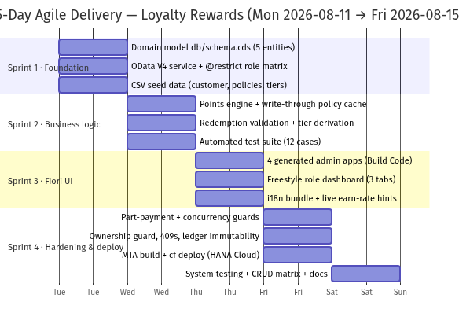

*Figure 4.1 — 5-day delivery timeline across the four sprints.*

## Sprint 1 — Foundation: data model, service, mock data

**Goal:** a running, role-protected OData v4 service over the full domain model, seeded for local demos.

| User story | Acceptance criteria |
|---|---|
| As an **admin (Deepa)** I define the domain model so purchases and redemptions can be recorded | `db/schema.cds` contains Customer, Transaction, Redemption plus the RewardPolicy / TierThreshold configuration entities; associations navigable |
| As a **developer** I expose the model as an OData v4 service | `srv/service.cds` serves `/odata/v4/loyalty`; `$metadata` lists all five entities |
| As a **developer** I have seed data for local runs | CSV seeds load: 1 customer, 2 channel policies (Online 0.05, Store 0.03), 3 tier thresholds (0 / 5,000 / 20,000) |
| As an **operator** the API is role-protected from day one | service `@(requires: 'authenticated-user')`; `@restrict` grants per role; anonymous `$metadata` → 401 |

## Sprint 2 — Business logic: points engine, redemption, tiers

**Goal:** every business rule from the problem statement executes server-side, with tests.

| User story | Acceptance criteria |
|---|---|
| As the **system** I compute points per channel policy | `pointsEarned = floor(amount × rate)`; Online > Store promotes digital adoption |
| As a **customer (Priya)** I can pay partly with points | `amount = price − pointsApplied × ₹0.50`; a Redemption row is auto-written for applied points |
| As the **system** I prevent over-redemption | `pointsUsed > totalPoints` → 400; balance never negative — atomic guarded UPDATE, HANA row-lock safe |
| As a **customer** my tier reflects lifetime earning | tier derived from `lifetimePoints`; re-derived for **all** customers when an admin changes thresholds |
| As a **developer** I can prove all of the above | `npm test` — 12 automated cases green |

## Sprint 3 — Fiori dashboards for customer and admin

**Goal:** role-appropriate UIs on top of the service, one per audience.

| User story | Acceptance criteria |
|---|---|
| As a **customer** I view my points, tier and histories | "My Account" tab: balance, tier, lifetime points, purchase + redemption history, self-registration on first login |
| As a **customer** I redeem points and register my own purchases | redeem form + purchase form with live earn-rate preview computed from the server-provided point value |
| As **retail staff (Arjun)** I record POS/Online purchases for a customer | email lookup (identity only — no purchase history exposed), purchase form with rate hint, new-customer onboarding |
| As **staff** I see my day at a glance | KPI tiles: Customers, Purchases, **Purchases today**, points issued total / Online / Store |
| As an **admin** I govern the program | policies + tier thresholds editable inline; gated customer-360 lookup; KPI tiles incl. **Outstanding points** (open liability) |
| As **any user** the UI is fully internationalized | single complete `i18n.properties` bundle; no hardcoded strings; zero missing keys in any locale |

## Sprint 4 — Hardening & deployment on SAP BTP (HANA Cloud)

**Goal:** production-grade guarantees and a live system.

| User story | Acceptance criteria |
|---|---|
| As an **operator** the app runs on BTP CF against SAP HANA Cloud | `mbt build` → `cf deploy`; HDI container holds the schema; XSUAA replaces mock auth |
| As an **operator** point mutations are safe under production concurrency | guarded UPDATEs verified by the parallel-redemption test — exactly one of two wins |
| As a **developer** role separation works end-to-end | mock users (alice/bob/carol) exercise the real `@restrict` matrix in tests — no silent privileged fallback |
| As a **team** the submission is reproducible | CRUD harness deployed with the app; 38-case matrix executed and recorded; prompts and docs complete |

## How it actually went (retrospective)

- Sprint 1 kept the grants tight from the start, which prevented an entire class of "oops, that entity was public" bugs later.
- The automated suite grew **alongside** the logic in Sprint 2, not after it — the tier-recompute-on-threshold-change behaviour was caught regressing more than once.
- Sprint 3's real learning was UI5 OData v4: inactive create contexts (a `list.create(data, …, true)` that looks fine and silently never sends) and backend errors arriving inside a `$batch` envelope (only visible through the message manager) each cost an evening.
- Sprint 4 shipped a real schema evolution through HDI: adding `price` and `pointsApplied` to Transaction mid-project was model-change → build → deploy, and HANA applied the additive columns without touching existing rows. One late review bug: users holding both admin and staff roles only ever got the admin KPI strip filled — now both strips load in parallel.

---

# 5. Test Case Sheet

## 5.1 Testing approach

Three complementary layers, all executed:

1. **Automated backend suite** — `npm test` (`test/loyalty.test.js`), `node --test` + `@cap-js/cds-test` against the real service on in-memory SQLite with three mock users (alice = customer, bob = staff, carol = admin). Real `@restrict` matrix, real handlers, real CSRF flow. **12/12 green.**
2. **Interactive CRUD matrix** — a self-contained test page (plain HTML + fetch, ~280 lines) deployed *with* the app at `/apitestharness/index.html`. "Run all cases" executes 36 requests against the live OData service and checks each response against the expected contract. Full local matrix: **38/38** (recorded response-by-response in `docs/crud-test-results.md`); on the deployed CF app as admin: **34/36** — the two "red" rows are the cross-role ownership cases, which *require* a customer-only login to show 403; as admin the guard correctly lets them through (201).
3. **Manual UI walkthrough** — the showcase in Section 7, one pass per role.

The endpoints are standard OData v4, so every case below also runs as-is in **Postman** or curl: same method, same URL, same JSON body, same expected status and message. Writes need `x-csrf-token: fetch` on a prior GET (the harness and the curl snippets below both show the pattern):

```bash
# token, then a purchase — points engine: floor(1000 × 0.05) = 50 pts
T=$(curl -s -u carol:pass -H "x-csrf-token: fetch" -o /dev/null -D - "$U/Customers?\$top=1" | grep -i x-csrf | tr -d '\r' | awk '{print $2}')
curl -X POST -u carol:pass -H "x-csrf-token: $T" -H "Content-Type: application/json" \
  -d '{"customerID_customerID":"<uuid>","channel":"Online","price":1000}' "$U/Transactions"
# → 201 … "amount":1000,"pointsEarned":50
```

## 5.2 Automated suite (12 cases, all passing)

Run: `npm test` →

```
ℹ tests 12
ℹ suites 3
ℹ pass 12
ℹ fail 0
ℹ duration_ms 853.9
```

| # | Area | Scenario | Expected & verified |
|---|---|---|---|
| 1 | Points | Online purchase ₹1,000 | 201; `pointsEarned 50` (×0.05); balance 50; lifetime 50; tier Bronze |
| 2 | Points | Store purchase ₹500 | 201; `pointsEarned 15` (×0.03) |
| 3 | Part-payment | Store ₹500 applying 20 pts | `amount 490`; `pointsEarned 14` (floor 490×0.03); balance 50−20+14 = 44; auto Redemption row (20 pts) |
| 4 | Validation | channel "Phone" / unknown customer / overspending pointsApplied | 400 with field-targeted error each |
| 5 | Redemption | redeem 51 of 50 → reject; redeem 30 of 50 → honour | 400 rejection; then balance 20 |
| 6 | Tier | lifetime crosses 5,000 (₹100,000 online purchase) | tier Silver immediately |
| 7 | Tier | admin adds threshold above a customer's lifetime, then deletes it | tier recomputes to the new tier and back — **without** a new purchase |
| 8 | Concurrency | two parallel full-balance redemptions (50 pts) | exactly one 201; final balance 0; never negative |
| 9 | API | `getUserInfo()` as admin & staff | role flags correct; `pointValueInr` 0.5 from the server |
| 10 | AuthZ | customer posts a purchase for another customer | rejected; own account accepted (201) |
| 11 | AuthZ | customer onboards a foreign / duplicate email | 403 / 409 rejected |
| 12 | AuthZ | staff reads/writes Redemptions and Policies | Redemptions read 403; Policies read 200; Policies write 403 |

## 5.3 Executed CRUD matrix (38 / 38 matched contract locally)

Endpoint `http://localhost:4004/odata/v4/loyalty`, executed 2026-08-15; ✅ = actual matched expected exactly.

**Customers**

| # | Operation | Request | Expected | Actual |
|---|---|---|---|---|
| C-01 | CREATE | `POST /Customers {name, email}` (admin) | 201, `tier: Bronze`, `totalPoints: 0` | ✅ 201 |
| C-02 | CREATE invalid | `{name:"", email:"x"}` | 400 `name is required` | ✅ 400 |
| C-03 | READ | `GET /Customers?$top=5&$select=…` | 200 list | ✅ 200 |
| C-04 | READ by key | `GET /Customers(customerID=…)` | 200 entity | ✅ 200 |
| C-05 | UPDATE | `PATCH /Customers(…) {name}` | **403** — no role has UPDATE; balances are system-owned | ✅ 403 |
| C-06 | DELETE | `DELETE /Customers(…)` | **403** — no role has DELETE | ✅ 403 |

**Transactions**

| # | Operation | Request | Expected | Actual |
|---|---|---|---|---|
| T-01 | CREATE | `{Online, price 1000}` | 201 — 50 pts (0.05/₹) | ✅ `pointsEarned 50`, `amount 1000` |
| T-02 | CREATE part-payment | `{Store, price 500, pointsApplied 20}` | 201 — payable 490, 14 pts + auto Redemption | ✅ `amount 490`, `pointsEarned 14` |
| T-03 | CREATE invalid channel | `{channel:"Phone"}` | 400 | ✅ `channel must be one of Online, Store` |
| T-04 | CREATE unknown customer | random UUID | 400 | ✅ `No customer found for …` |
| T-05 | CREATE overspend | `pointsApplied 9999 > balance 44` | 400 | ✅ `Insufficient points: customer has 44, tried to apply 9999` |
| T-06 | READ filtered | `$filter=customerID_customerID eq …` | 200 rows | ✅ Online 1000/50, Store 490/14 |
| T-07 | READ aggregate | `$apply=groupby((channel),aggregate(pointsEarned with sum as total))` | 200 per-channel totals | ✅ Online 60, Store 14 |
| T-08 | UPDATE | `PATCH /Transactions(…)` | **403** — immutable ledger | ✅ 403 |
| T-09 | DELETE | `DELETE /Transactions(…)` | **403** — immutable ledger | ✅ 403 |

**Redemptions**

| # | Operation | Request | Expected | Actual |
|---|---|---|---|---|
| R-01 | CREATE | `{pointsUsed:10, remarks}` (admin) | 201 — balance −10 | ✅ 201 |
| R-02 | CREATE overspend | `pointsUsed 99999 > balance 34` | 400 | ✅ `Insufficient points: customer has 34, tried to redeem 99999` |
| R-03 | CREATE invalid | `pointsUsed: 0` | 400 | ✅ `pointsUsed must be a positive integer` |
| R-04 | READ filtered | by customer | 200 — part-payment + standalone rows | ✅ 200 |
| R-05 | UPDATE | `PATCH /Redemptions(…)` | 403 — immutable ledger | ✅ 403 |
| R-06 | DELETE | `DELETE /Redemptions(…)` | 403 — immutable ledger | ✅ 403 |

**RewardPolicies (admin-managed)**

| # | Operation | Request | Expected | Actual |
|---|---|---|---|---|
| P-01 | READ | `GET /RewardPolicies` (admin) | 200 — Online 0.05, Store 0.03 | ✅ 200 |
| P-02 | CREATE conflict | duplicate `channel:"Online"` | 409 one-policy-per-channel | ✅ `A reward policy for channel Online already exists` |
| P-03 | CREATE invalid | `channel:"Catalog"` | 400 | ✅ `channel must be one of Online, Store` |
| P-04 | UPDATE | `PATCH {rate 0.04}` | 200 + cache reloaded | ✅ next purchases earned at 0.04 (restored after) |
| P-05 | READ as staff | bob | 200 read-only | ✅ 200 |
| P-06 | WRITE as staff | `POST` as bob | 403 | ✅ 403 |

**TierThresholds (admin-only)**

| # | Operation | Request | Expected | Actual |
|---|---|---|---|---|
| H-01 | READ | admin | 200 Bronze/Silver/Gold | ✅ 200 |
| H-02 | CREATE | `{tier:"Harness", minLifetimePoints:10}` | 201 + immediate tier recompute | ✅ customer with lifetime ≥ 10 became `Harness` |
| H-03 | READ verify | customer by key | tier `Harness` | ✅ `"tier":"Harness"` |
| H-04 | UPDATE | `{minLifetimePoints: 500000}` | 200 + recompute | ✅ 200 |
| H-05 | READ verify | customer by key | tier back to Bronze | ✅ `"tier":"Bronze"` |
| H-06 | DELETE | `DELETE /TierThresholds('Harness')` | 204 cleanup | ✅ 204 |
| H-07 | READ as staff | bob | 403 | ✅ 403 |

**Function import & cross-role (customer login — alice)**

| # | Operation | Request | Expected | Actual |
|---|---|---|---|---|
| U-01 | FUNCTION | `GET /getUserInfo()` | 200 flags + pointValueInr | ✅ `email:"alice@example.com"`, `pointValueInr:0.5` |
| X-01 | CREATE foreign | purchase for another customer | 403 — ownership precedes validation | ✅ `Customers may only act on their own account` |
| X-02 | CREATE duplicate | re-register `alice@example.com` | 409 | ✅ `An account for alice@example.com already exists` |
| X-03 | CREATE foreign | redemption for another customer | 403 | ✅ 403 |
| X-04 | CREATE own | purchase for own seeded account | 201 | ✅ 5 pts for ₹100 Online |

## 5.4 Failure cases — the ones that prove the handler logic

Each failure below is a designed, asserted behaviour (not an accident), and every message is returned with the offending field as the error target so a UI can highlight the right input:

- `POST /Customers` missing name → 400 `name is required`
- `POST /Customers` invalid email → 400 `a valid email address is required`
- `POST /Customers` duplicate email (any role) → 409 `An account for … already exists`
- `POST /Transactions` invalid channel → 400 `channel must be one of Online, Store`
- `POST /Transactions` price ≤ 0 → 400 `price must be greater than 0`
- `POST /Transactions` unknown customer → 400 `No customer found for <id>`
- `POST /Transactions` overspending pointsApplied → 400 `Insufficient points: customer has N, tried to apply M`
- `POST /Redemptions` pointsUsed > balance → 400 `Insufficient points: …`
- `POST /Redemptions` pointsUsed = 0 or negative → 400 `pointsUsed must be a positive integer`
- customer acting on a foreign account (transaction **or** redemption) → 403, before any validation leaks whether the account exists
- PATCH/DELETE on Customers, Transactions, Redemptions → 403 for every role (system-owned balances, immutable ledger)

## 5.5 Points logic & tier boundary tests

- **Both channel rates**: ₹1,000 Online → 50 pts; ₹500 Store → 15 pts (cases 1–2).
- **Part-payment arithmetic**: ₹500 Store with 20 pts → payable ₹490, 14 earned, balance 50−20+14 = 44, exactly one auto-Redemption row (case 3).
- **Grid flooring**: ₹75.30 → ₹75.00 payable-grid; payables never show odd fractions (showcase, Figure 7.11).
- **Tier transition**: lifetime crossing 5,000 → Silver on that same request (case 6); boundary is `>=` (5,000 exactly promotes).
- **Threshold change recompute**: add `TestGold @ 10` → existing customers re-tier instantly; delete it → tiers restore (case 7, H-02…H-05). Tier *downgrade after redemption* is impossible by design — `lifetimePoints` is never decremented (showcase, Figure 7.3).

## 5.6 Concurrency test

Two full-balance redemptions (50 pts each) fired in parallel with `Promise.allSettled`: exactly one fulfills with 201, the other is rejected, final balance 0 — **never negative**. This is the guarded UPDATE from 3.5 doing its job; on SQLite's single connection it also guards against handler interleaving, and on HANA it is row-lock safe.

## 5.7 Issues the test matrix found (and fixed) — honest log

1. **Ownership guard ordering** — a customer posting for a foreign account first received the handler's `400 No customer found` instead of `403`: two competing `before CREATE` hooks ran in the wrong order. Fixed by extracting the guard into `srv/lib/ownership.js` and invoking it **first** in both the transaction and redemption hooks.
2. **No field validation on Customer CREATE** — `{name:"", email:"x"}` was accepted (201). Fixed in `srv/service.js`: 400 on empty name / invalid email; staff/admin onboarding also gets the 409 duplicate check.
3. **Duplicate policy channel surfaced a raw 500** (`SQLITE_CONSTRAINT_UNIQUE`; would be an HANA constraint error). Fixed: explicit 409 in `handlers/policy.js`.
4. **Harness keying** — RewardPolicies PATCH/DELETE are keyed by surrogate `policyID`, not `channel`; corrected in the harness and documented.

## 5.8 Manual UI cases (dashboard walkthrough)

| # | Role | Scenario | Expected |
|---|---|---|---|
| M1 | customer | first login | account auto-created, welcome toast, My Account active |
| M2 | customer | purchase form, tweak points | live hint: rate, grid price, covered amount, payable, earned pts |
| M3 | customer | redeem | balance drops, history row, toast |
| M4 | staff | search by email | identity card, no history, unknown email → message |
| M5 | staff | record purchase | points toast, balance refresh, KPIs incl. Purchases today update |
| M6 | staff | add customer | created + selected for entry, Customers +1 |
| M7 | admin | lookup by email/UUID | full 360: purchases + redemptions |
| M8 | admin | change rate/threshold | saved; hints re-derive; tiers recompute (case 7 automates backend) |
| M9 | admin | KPI strip | all tiles incl. Outstanding points = Σ balances |
| M10 | any | non-English browser locale | no raw `kpiXxx` keys — single complete i18n bundle |

---

# 6. Deployment Steps

## 6.1 Prerequisites

- SAP BTP subaccount (trial works) with entitlements for **SAP HANA Cloud**, **XSUAA**, **HTML5 App Repository**, **Destination** (lite), Cloud Foundry runtime
- Cloud Foundry CLI (`cf`) logged in — this project: `api.cf.us10-001.hana.ondemand.com`, org `9231c958trial`, space `dev`
- Node.js ≥ 20, `@sap/cds` CLI (CDS DK v9), `mbt` (MTA Build Tool)
- The repo (source zip or git clone); `npm install` resolves the root + `app/*` workspaces

## 6.2 Deployment pipeline

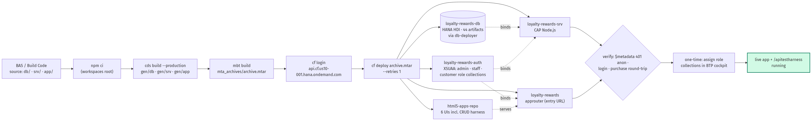

*Figure 6.1 — From source to live: one MTA archive provisions and updates the entire stack. The same `mta.yaml` ships the CRUD test harness, so the test page is part of the deployed system, not a local tool.*

## 6.3 Step by step (annotated, with real outputs)

```bash
# 1. Install — root + UI workspaces in one shot
npm install
# → added 1 package in 2s

# 2. Local check before building (optional but recommended):
npm run watch        # cds watch on :4004, mock users alice/bob/carol (pass "pass")
npm test             # 12/12 — do not ship red

# 3. Build the MTA archive.
#    `mbt build` first runs the before-all hook: `npm ci` + `cds build --production`,
#    which emits gen/db (HANA design-time artifacts), gen/srv (CAP service),
#    gen/app (the six UIs, each bundled by its own build step), then packs the .mtar.
npm run build
# → INFO the MTA archive generated at: …/mta_archives/archive.mtar
#    (44 HANA HDI artifacts inside for the db-deployer)

# 4. Target the space (once per shell)
cf login -a https://api.cf.us10-001.hana.ondemand.com

# 5. Deploy. cf deploy orchestrates: create/update services, run the HDI db-deployer
#    task (applies the CDS-derived schema), start srv + approuter, upload the UIs
#    to the HTML5 repo. --retries 1 rides over transient trial-cloud hiccups.
npm run deploy       # = cf deploy mta_archives/archive.mtar --retries 1
# → Binding service instance "loyalty-rewards-auth" to application "loyalty-rewards"…
#   Application "loyalty-rewards-srv" started and available at
#     "9231c958trial-dev-loyalty-rewards-srv.cfapps.us10-001.hana.ondemand.com"
#   Process finished.

# 6. Verify the service landscape
cf services | grep loyalty
# → loyalty-rewards-auth             xsuaa           application  create succeeded
#   loyalty-rewards-db               hana            hdi-shared   create succeeded
#   loyalty-rewards-html5-repo-host  html5-apps-repo app-host     create succeeded
#   loyalty-rewards-html5-runtime    html5-apps-repo app-runtime  create succeeded
#   loyalty-rewards-destination-…    destination     lite         create succeeded

# 7. Verify security posture (anonymous must NOT see data)
curl -o /dev/null -w "%{http_code}\n" https://…-loyalty-rewards-srv…/odata/v4/loyalty/\$metadata
# → 401  (XSUAA JWT required)
curl -o /dev/null -w "%{http_code}\n" https://9231c958trial-dev-loyalty-rewards.cfapps.us10-001.hana.ondemand.com/
# → 302  (approuter redirects to the login page)
```

One-time manual step: in the BTP cockpit, assign the generated role collections — `admin`, `staff`, `customer` — to your user (the MTA creates them with the XSUAA service; it cannot assign users). Then open the approuter URL and log in.

## 6.4 What the MTA creates

| Module / resource | Type | Runtime / plan | Purpose |
|---|---|---|---|
| `loyalty-rewards-srv` | nodejs module | CF app (nodejs buildpack) | CAP service, bound to HANA + XSUAA; serves `/odata/v4/loyalty` |
| `loyalty-rewards-db-deployer` | hdb module | CF task | pushes `gen/db` design-time artifacts into the HDI container on every deploy |
| `loyalty-rewards` | approuter.nodejs | CF app | entry point: XSUAA login, routes `/odata/*` to srv, serves the HTML5 apps, CSRF-protects mutations |
| `loyalty-rewards-app-deployer` | com.sap.application.content | — | uploads the six built UIs into the HTML5 repository |
| 6 × html5 modules | html5 | — | loyalty-dashboard, customers/transactions/tier-thresholds-management, reward-policies, api-test-harness |
| `loyalty-rewards-db` | hdi-container | hana / hdi-shared | **SAP HANA Cloud** persistence — schema owned by the container |
| `loyalty-rewards-auth` | xsuaa | application | scopes + role templates from `xs-security.json`: admin, staff, customer (+ userattributes carrying the email) |
| `loyalty-rewards-html5-repo-host` / `-runtime` | html5-apps-repo | app-host / app-runtime | store and serve the frontends |
| `loyalty-rewards-destination-service` | destination | lite | `ui5` destination serving SAPUI5 resources from `https://ui5.sap.com` |

## 6.5 Post-deployment verification & schema evolution

1. Open the deployed dashboard URL → login → the role chip shows the strongest assigned role.
2. Record a purchase as staff; confirm balance/tier change on the customer.
3. BTP cockpit → SAP HANA Cloud → Database Explorer: `LOYALTY_CUSTOMER` / `LOYALTY_TRANSACTION` / `LOYALTY_REDEMPTION` rows visible in the HDI container.
4. Run the CRUD harness at `/apitestharness/index.html` — see Section 7.4.

Schema evolution through this pipeline is real, not theoretical: `price` and `pointsApplied` were added to Transaction mid-project — change the model, `mbt build`, `cf deploy`; HANA applies the additive columns without touching existing rows (`0 files to deploy` on unchanged schema, `Exit status 0`).

Teardown, when needed: `npm run undeploy` → `cf undeploy loyalty-rewards --delete-services --delete-service-keys --delete-service-brokers`.

## 6.6 Deployment evidence

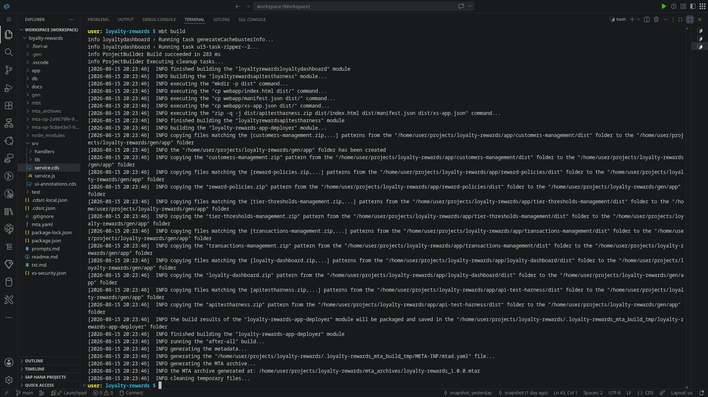

*Figure 6.2 — `mbt build` producing the MTA archive.*

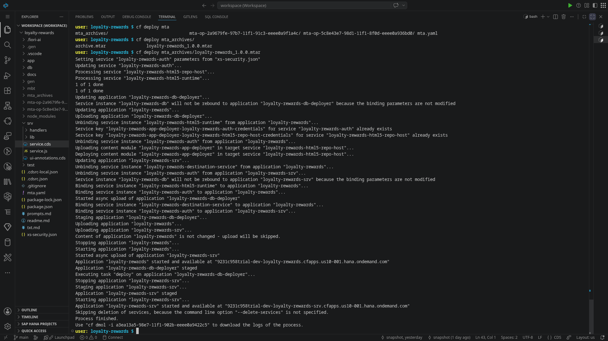

*Figure 6.3 — `cf deploy` full output ending in "Process finished."*

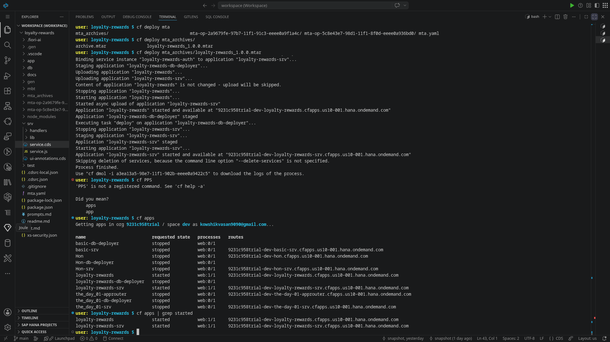

*Figure 6.4 — `cf apps`: `loyalty-rewards` (approuter) and `loyalty-rewards-srv` both **started**, with their live URLs.*

---

# 7. Application Showcase — Executed Output

The assessment requires the application to be **executed to display the output**. Everything below is from the deployed system at <https://9231c958trial-dev-loyalty-rewards.cfapps.us10-001.hana.ondemand.com/loyaltydashboard/index.html>. The dashboard is one freestyle UI5 app with three tabs; it opens on the tab matching your strongest role.

## 7.1 Customer view — "My Account"

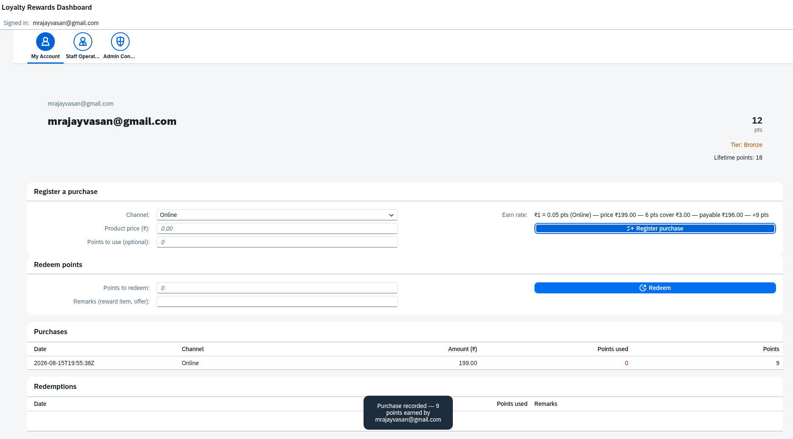

*Figure 7.1 — The purchase form is where part-payment meets the customer. The grey hint recalculates on every keystroke: `₹1 = 0.05 pts (Online) — price ₹199.00 — 6 pts cover ₹3.00 — payable ₹196.00 — +9 pts` — the whole server computation made visible **before** submission. The points field is clamped live to what balance and price allow.*


*Figure 7.2 — Toast `Purchase recorded: 9 points earned`, and the row lands in purchase history (date, channel, price, points used, points earned) — exactly the previewed numbers.*

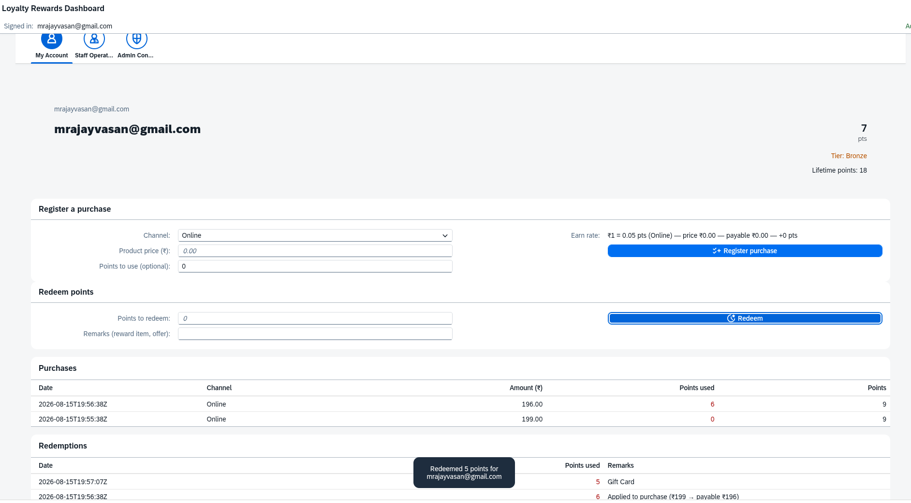

*Figure 7.3 — Standalone redemption: 5 pts out against remark "Gift Card", balance 12 → 7, and the redemptions table shows it next to the earlier 6-pt part-payment row. Lifetime points stays 18 — redeeming never costs a tier.*

## 7.2 Retail staff view — "Staff Operations"

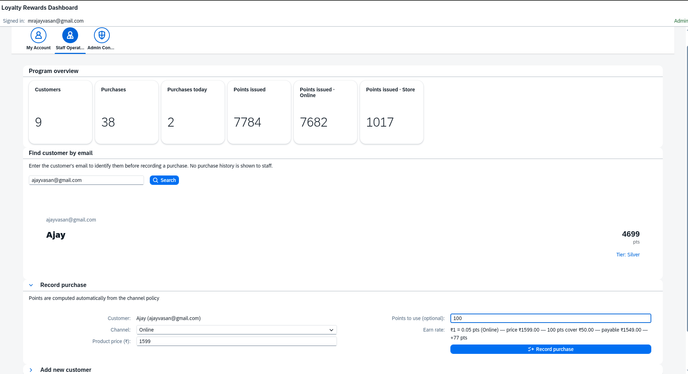

*Figure 7.4 — KPI strip tuned to the working day (customers, total purchases, purchases today, points issued by channel). Find by email returns identity + balance + tier **only**. Mid-story: customer found (4,676 pts, Silver), ₹1,599 purchase with 100 pts applied, live hint `price ₹1,599.00 — 100 pts cover ₹50.00 — payable ₹1,549.00 — +77 pts`.*

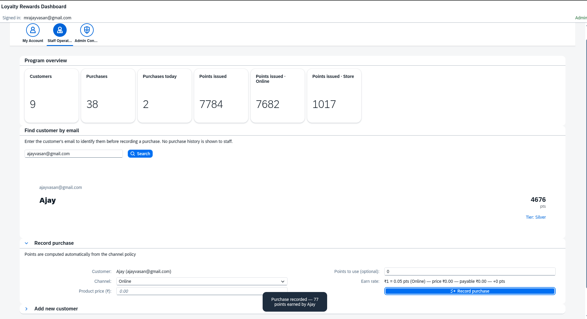

*Figure 7.5 — `Purchase recorded: 77 points earned` — floor(1,549 × 0.05) = 77, exactly what the hint promised; program counters tick up.*

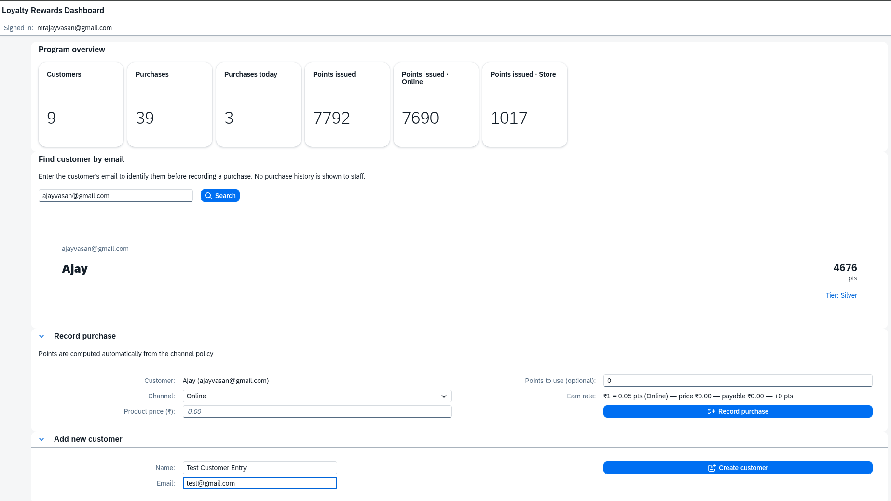

*Figure 7.6 — Onboarding a customer at the counter: name + email, one click.*

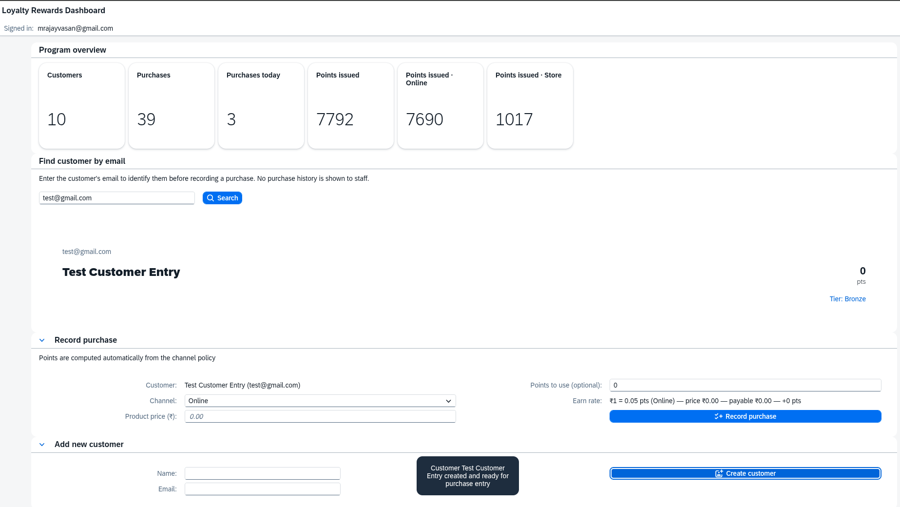

*Figure 7.7 — Customer created (count 9 → 10), and the finder selects the new account (0 pts, Bronze) so the very next action can be their first purchase.*

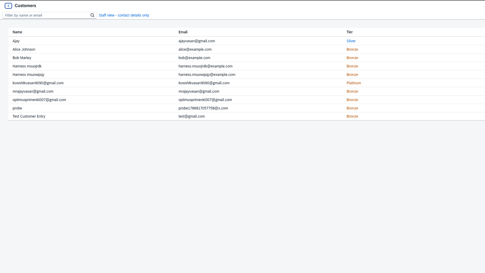

*Figure 7.8 — The staff directory: name, email, tier. No drill-down, no balances, no history — staff do not get financial data.*

## 7.3 Admin view — "Admin Console"

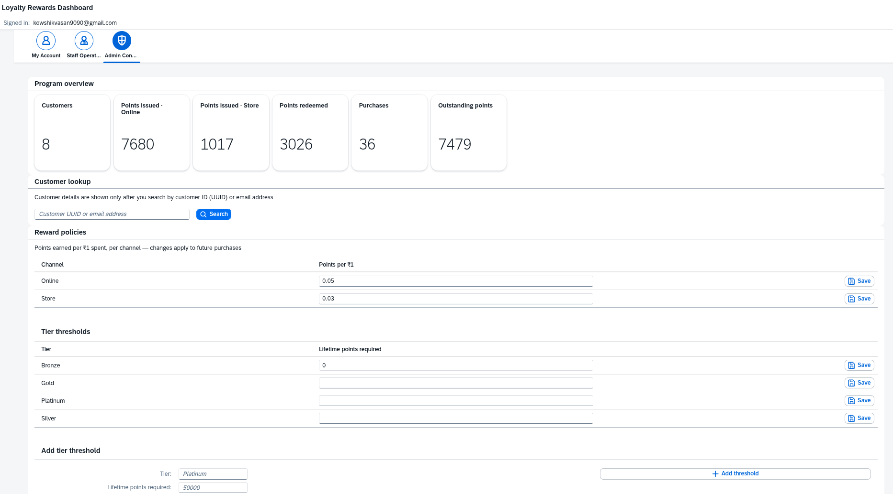

*Figure 7.9 — Program KPIs (8 customers, 36 purchases, 7,680 pts issued online / 1,017 in store, 3,026 redeemed, **7,479 outstanding** — the open points liability) above the live rule tables: Online 0.05 / Store 0.03 per ₹1, tier thresholds with Platinum pre-filled at 50,000.*

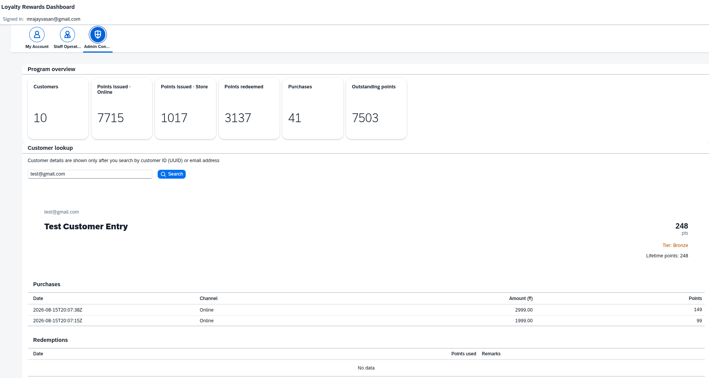

*Figure 7.10 — The gated customer-360 lookup (by email or UUID): balance, lifetime points, purchase history, redemptions — nothing about any individual is shown until an admin actively searches.*

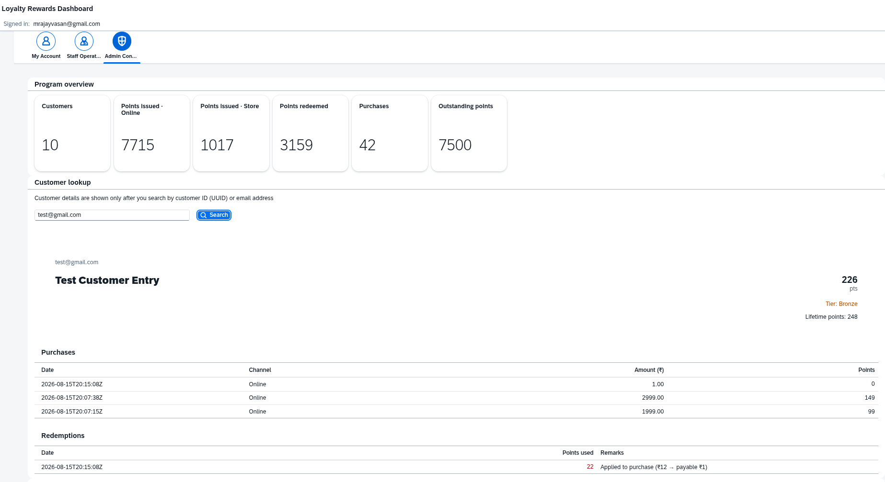

*Figure 7.11 — The best single exhibit of points-as-payment: a ₹12 purchase with 22 pts applied → one transaction (payable ₹1, 0 pts earned) **plus** one automatic redemption row `Applied to purchase (₹12 → payable ₹1)`; balance 248 → 226, lifetime stays 248.*


*Figure 7.12 — Editing the Online rate inline; the write-through cache reloads in the same request, so the next purchase already uses the new rate.*

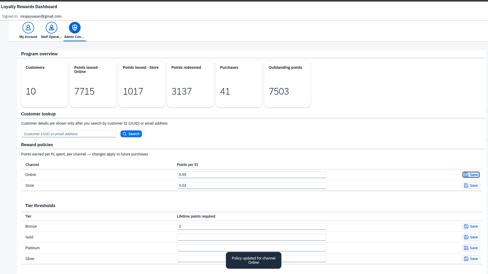

*Figure 7.13 — Rate experiments during testing (0.50, then 5.55/₹1) — also the honest explanation for the very large test balances (e.g. a 66,742-point Platinum account in the master list).*

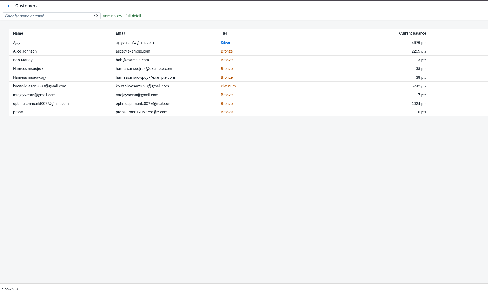

*Figure 7.14 — The customer master list: the whole base with balances and tiers — the admin counterpart of the staff directory.*

## 7.4 CRUD harness — executed

The interactive test page (Section 5) is deployed with the app at `/apitestharness/index.html`; its full-run printout ships as the exhibit **"Loyalty Service — CRUD API Test Harness.pdf"** in the design artifacts. Extra walkthrough depth:

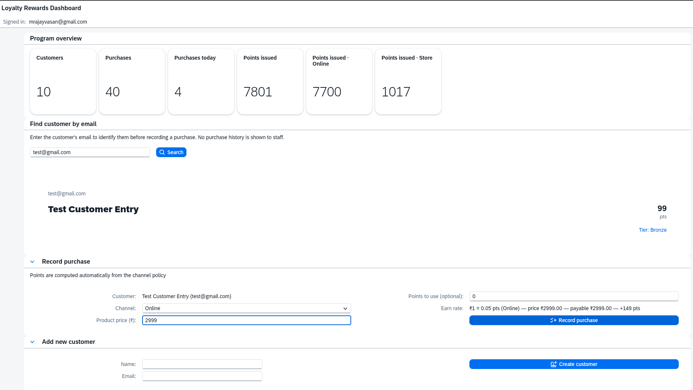

*Figure 7.15 — Staff recording a ₹2,999 purchase for the freshly onboarded test customer.*

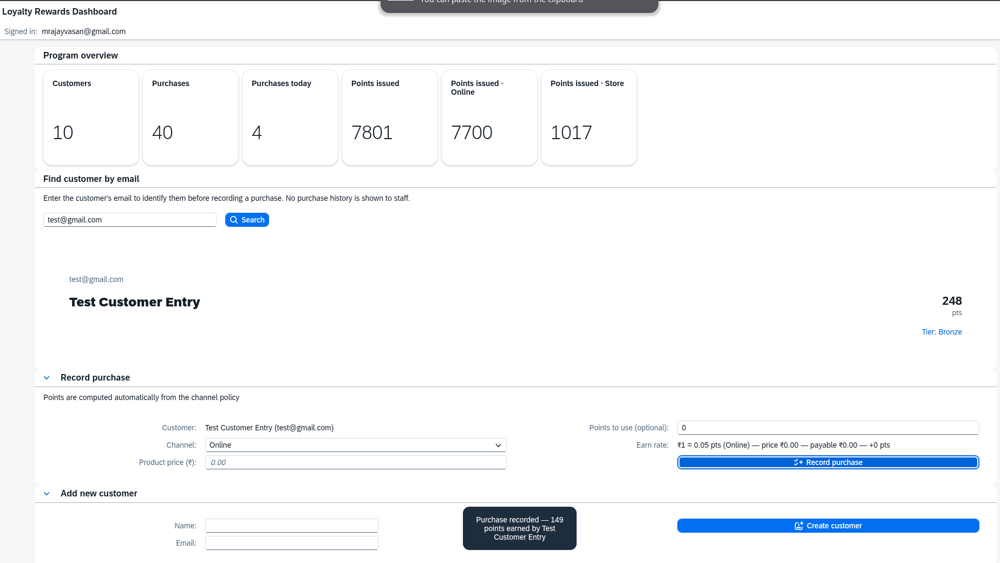

*Figure 7.16 — Result: 149 pts earned (floor(2999 × 0.05)), visible immediately in the customer's history.*

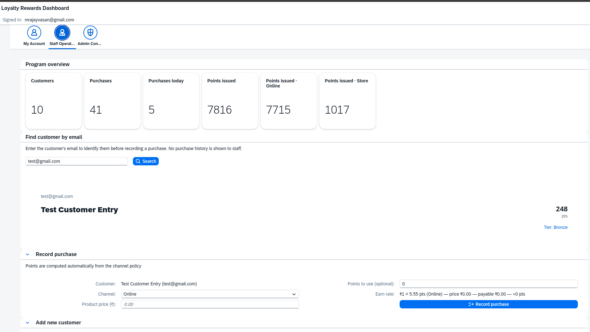

*Figure 7.17 — Admin KPI strip mid-testing — the aggregates recomputing live as the matrix writes data.*

---

# 8. Build Code Prompts

> Per the assessment instructions: *"Implement the solution using both BAS and Build Code. Submit the prompts used in Build Code, and ensure the application is executed to display the output."* The prompts below are the complete log; the executed output is Section 7 and the live URLs.

**What Build Code (Joule) was used for:** project scaffolding with the MTA/XSUAA/HANA skeleton, the CDS domain model and service exposure with the role matrix, the three handler modules, generation of the four admin Fiori apps, the backend test suite, and the final MTA assembly. Prompt quality mattered more than prompt count: each prompt pins the entity names, the service path `/odata/v4/loyalty`, the exact columns/facets wanted, and the role the artifact serves. The generated apps needed almost no manual repair — the real hand-work was wiring them into the MTA and the role model, which prompts don't cover.

## 8.1 Prompt log

| # | Sprint | Stage | Prompt (summary) | Artifact produced |
|---|---|---|---|---|
| 1 | 1 | Scaffold | CAP Node.js project with MTA, approuter, XSUAA roles, HANA prod / SQLite dev | `mta.yaml`, `xs-security.json`, `app/router/`, package profiles |
| 2 | 1 | Domain model | Customer / Transaction / Redemption exactly per spec | `db/schema.cds` |
| 3 | 1 | Model extensions | lifetimePoints, price, pointsApplied, RewardPolicy, TierThreshold + CSV seeds | schema extensions, `db/data/*.csv` |
| 4 | 1 | Service | LoyaltyService at `/odata/v4/loyalty` + full `@restrict` matrix + `getUserInfo` | `srv/service.cds` |
| 5 | 2 | Points engine | grid flooring, part-payment, cached rates, guarded atomic balance UPDATE | `srv/handlers/transaction.js`, `srv/lib/*` |
| 6 | 2 | Redemption | positive-integer validation, sufficient balance, atomic deduction | `srv/handlers/redemption.js` |
| 7 | 2 | Policy admin | channel validation, cache reload, tier recompute, ownership/onboarding guards | `srv/handlers/policy.js`, guards + `getUserInfo` in `srv/service.js` |
| 8 | 3 | Admin UIs | four List Report/Object Page apps with value helps | `app/customers-management`, `transactions-management`, `reward-policies`, `tier-thresholds-management` |
| 9 | 3 | Dashboard | freestyle role dashboard, 3 tabs, KPI tiles, i18n, server-provided point value | `app/loyalty-dashboard` |
| 10 | 4 | Tests | node --test suite: rates, part-payment, rejections, tiers, concurrency, role guards | `test/loyalty.test.js` |
| 11 | 4 | Deployment | assemble the MTA (db-deployer, srv, approuter, html5 repo, destination) + npm scripts | final `mta.yaml`, `docs/deployment.md` |

## 8.2 Prompts, verbatim

**1 — Project scaffold (Sprint 1)**

```text
Create a CAP Node.js project "loyalty-rewards" for a Retail Omni-Channel
Customer Loyalty & Rewards Management system. Use MTA deployment with an
approuter, XSUAA with roles admin, staff and customer, and SAP HANA (hdi-shared)
as the production database with SQLite for local development.
```

**2 — Domain model (Sprint 1)**

```text
In db/schema.cds model entity Customer (customerID UUID key, name, email,
totalPoints, tier), Transaction (txnID UUID key, customerID association to
Customer, channel Online|Store, amount Decimal(10,2), txnDate, pointsEarned),
and Redemption (redeemID UUID key, customerID association, pointsUsed,
redeemDate, remarks). All managed. Add totalPoints default 0 and tier
default 'Bronze'.
```

**3 — Model extensions (Sprint 1)**

```text
Extend the model: Customer gets lifetimePoints (never decreases, drives tier
promotion). Transaction gets price (product list price) and pointsApplied
(reward points used as part-payment, 1 point = 0.50 INR). Add configuration
entities RewardPolicy (channel-unique points per currency unit, e.g. Online
0.05, Store 0.03) and TierThreshold (tier, minLifetimePoints; Bronze 0,
Silver 5000, Gold 20000). Seed them with CSV files.
```

**4 — Service exposure (Sprint 1)**

```text
Expose all entities in srv/service.cds as LoyaltyService at /odata/v4/loyalty,
requires authenticated-user. Add @restrict grants: Customers — read for
admin/staff, read+create for customer where email = $user.email, create for
staff/admin; Transactions — read+create for admin/staff, read for customer
where customerID.email = $user.email, create for customer (own account,
enforced in a handler); Redemptions — read+create for admin and for customer
(own); RewardPolicies — all for admin, read for staff; TierThresholds —
admin only. Add a getUserInfo() function returning id, email, name, role
flags and pointValueInr.
```

**5 — Points engine (Sprint 2)**

```text
On CREATE of Transaction validate channel and customer, denominate the price
on the 0.50 INR grid, compute amount = price − pointsApplied × 0.50 and
pointsEarned = floor(amount × channel policy rate) from a cached policy
store. If pointsApplied > 0 also insert a Redemption row and adjust the
customer balance. Update totalPoints and lifetimePoints and recompute the
tier from tier thresholds. Make the balance update a single atomic guarded
UPDATE (totalPoints = totalPoints − applied + earned WHERE
totalPoints >= applied) so concurrent purchases can never overspend — this
must also be safe on SAP HANA row locks.
```

**6 — Redemption logic (Sprint 2)**

```text
On CREATE of Redemption validate a positive integer pointsUsed, reject when
it exceeds the customer's totalPoints, and deduct atomically like the
transaction handler. Points must never go below zero.
```

**7 — Policy admin + guards (Sprint 2)**

```text
Validate RewardPolicy channel values against the same channel list as
transactions. Reload the policy cache on any RewardPolicy or TierThreshold
change, and when thresholds change recompute every existing customer's tier
immediately. Also add before-CREATE guards on Customers and Transactions:
customers may only onboard with their own login email (reject duplicates
with 409) and may only register purchases for their own account. Resolve
emails from either user.email or user.attr.email so XSUAA and mock users
both work.
```

**8a — Generated admin apps (Sprint 3, `/fiori-gen-cap-ui`)**

```text
Build me a List Report Object Page app on the Customers entity from
LoyaltyService. List page columns: name, email, totalPoints, lifetimePoints,
tier. On the object page I want three facets: one showing the customer's
purchases (that's the transactions navigation), one showing their
redemptions, and one called "Change History" showing the changes navigation.
Hide the customerID field everywhere, nobody needs to see a raw UUID.
```

```text
Build me a List Report Object Page app on the Transactions entity from
LoyaltyService. List columns: txnDate, channel, amount, pointsEarned. The
customer field on this entity needs a value-help dropdown that searches by
name and email, not a raw ID picker — wire it up as a ValueList against
Customers so staff can just type a customer's name when logging a purchase.
```

```text
Build me a List Report Object Page app on the RewardPolicies entity from
LoyaltyService. List columns: channel, pointsPerCurrencyUnit. Add a "Change
History" facet on the object page so admins can see the history of rate
changes. Hide policyID, it's just an internal key.
```

```text
Build me a List Report Object Page app on the TierThresholds entity from
LoyaltyService. List columns: tier, minLifetimePoints. Add a "Change
History" facet on the object page, same as the reward policy app, so admins
can see when tier boundaries were last edited.
```

**9 — Role-based dashboard (Sprint 3)**

```text
Build a custom Freestyle UI5 dashboard "loyalty-dashboard" with an IconTabBar
per role. Customer tab: balance/tier header, register-purchase form with live
earn-rate preview, redeem form, purchase + redemption history, self-onboarding
on first login. Staff tab: KPI tiles (Customers, Purchases, Purchases today,
Points issued total/Online/Store), find-customer-by-email (identity only),
record purchase with rate hint, add customer, customer directory. Admin tab:
KPI tiles (Customers, Points issued Online/Store, Points redeemed, Purchases,
Outstanding points = sum of customer balances), gated customer lookup by UUID
or email with full history, editable reward policies and tier thresholds,
add threshold. Everything internationalized via a single i18n bundle; the
point value must come from getUserInfo, not a client constant.
```

**10 — Backend tests (Sprint 4)**

```text
Create a node --test suite with @cap-js/cds-test under the [test] profile
(basic mock users alice=customer, bob=staff, carol=admin): per-channel points
math, part-payment arithmetic, invalid channel/customer/overspend rejections,
redemption beyond balance, tier promotion at threshold, tier recompute on
threshold change, two concurrent full-balance redemptions where exactly one
wins, and role-guard checks including getUserInfo pointValueInr.
```

**11 — Deployment (Sprint 4)**

```text
Assemble the MTA: db-deployer for the HANA HDI container, nodejs srv bound
to the HDI container and XSUAA, html5 repo host + deployer for the five UIs,
destination and connectivity for the approuter. Provide npm scripts build
(mbt build) and deploy (cf deploy).
```

## 8.3 Prompt evidence

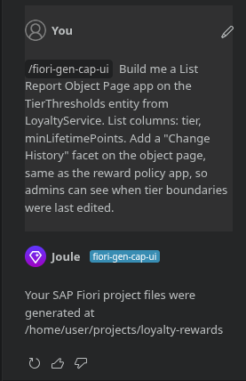

*Figure 8.1 — Build Code session: prompt and generated code.*

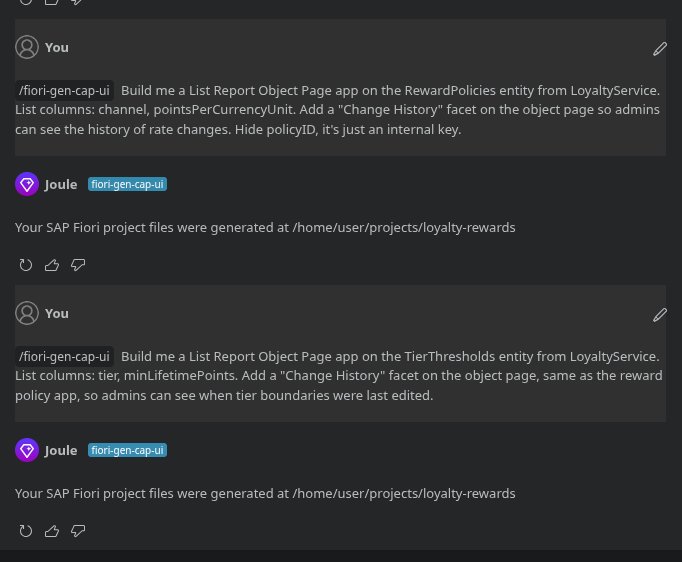

*Figure 8.2 — Build Code session: prompt and generated code.*

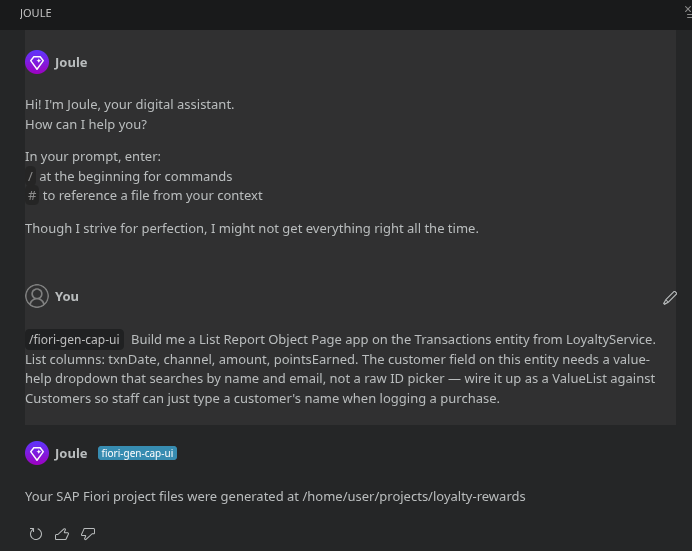

*Figure 8.3 — Build Code session: prompt and generated code.*

---

# 9. Conclusion & Learning Outcomes

## 9.1 Summary

One service, five entities, three roles, and a set of guarantees the tests actually pin down: points computed from admin-editable policies, redemptions that can never overdraft a balance, part-payments that move money and points atomically, and an API that refuses to leak data a role shouldn't see. The system is live on BTP Cloud Foundry against SAP HANA Cloud, with the CRUD harness deployed next to it — the submission demonstrably runs.

## 9.2 Learning outcomes

| Outcome | How it is demonstrated |
|---|---|
| End-to-end CAP flow: model → service → handlers → UI → deploy | Sections 2, 3, 7, 6 |
| Business rules as event handlers, kept out of UI and DB | `srv/handlers/` (Section 3), UIs contain no points math |
| CDS domain modelling incl. deliberate normalisation choices | config entities, lifetime/spend split, ledger immutability (Section 2.1) |
| OData v4 specifics: CSRF, `$batch` error envelopes, `$apply` aggregates, value helps | Sections 3.2, 5.1, Sprint 3 retro |
| Authorization: `@restrict` matrix + instance-level ownership (`where $user.email`) | Sections 3.1, 3.9; verified by cases 10–12, X-01…04 |
| Concurrency correctness on a real database | guarded atomic UPDATEs + parallel-redemption test (3.11, 5.6) |
| Performance thinking: write-through cache on the hot path | Section 3.6 |
| Fiori UI5: generated LROP apps + freestyle dashboard, i18n discipline | Section 7, Sprint 3 |
| BTP operations: MTA assembly, HDI schema evolution, XSUAA role collections | Section 6 incl. the mid-project column addition |
| Test-first verification culture | 12 automated + 38-case executed matrix + honest defect log (Section 5) |
| Agile delivery: 4 sprint increments, each runnable | Section 4 + git tags per working state |

## 9.3 Challenges & solutions

| Challenge | Solution |
|---|---|
| Nested transactions deadlocked SQLite (`srv.tx()` inside a request) | bare `INSERT`/`UPDATE`/`SELECT` against `cds.db` — joins the active request transaction, no nesting; documented in-code because it is non-obvious |
| Two competing `before CREATE` hooks let validation run before the role guard (400 leaked account existence) | extracted `assertOwnCustomer`, invoked **first** in both handlers — 403 before any 400 |
| Concurrent double-spend of the same points | single guarded UPDATE computed by the database (`WHERE totalPoints >= used`); parallel test proves exactly one winner |
| CDS `enum` doesn't reject invalid values at runtime | explicit channel validation in the transaction *and* policy handlers, same shared constant list |
| Unique-constraint violations surfaced as raw 500s | pre-checked and converted to clean 409s (duplicate email, duplicate channel policy) |
| UI5 OData v4 create that silently never sent (inactive create context) | learned to check binding contexts; cost an evening, now in the retro |
| Backend errors invisible inside `$batch` envelopes | routed through the message manager for toasts |
| Mixed locales showed raw `kpiXxx` keys | one complete `i18n.properties` bundle + parameterised rate-hint format strings |
| XSUAA emails live in `attr.email`, mock users in `user.email` | one resolver used everywhere (service + ownership guard) — dev and prod behave identically |

## 9.4 Future enhancements

- Points expiry with cohort batching (needs a scheduled job — CF tasks or Event Mesh)
- Notifications on tier promotion (email/Push via BTP services)
- Channel- and tier-multiplier promotions (time-boxed campaigns layered on RewardPolicy)
- Reporting facet: redemption-funnel and liability-ageing analytics on HANA calculation views
- Multi-tenancy (SaaS registry) to serve multiple retail brands from one deployment
- Rate-change history analytics — the change-tracking data is already captured

---

# Appendix A — Requirements Coverage

| Requirement (problem statement) | Where it is satisfied |
|---|---|
| Track purchases from Online and Store in one system | `channel` on Transaction, one customer balance (Sections 2, 3.4) |
| Points computed dynamically per channel policy | points engine + write-through policy cache (3.4, 3.6) |
| Online earns more to promote digital adoption | seeded rates Online 0.05 / Store 0.03 per ₹1, admin-editable |
| Redemption validates enough points — never below zero | guarded `UPDATE … WHERE totalPoints >= pts`, 400 on shortfall (3.5, 5.6) |
| Points deducted after successful redemption | same guarded UPDATE, same transaction as the validated create (3.5) |
| Customer: view points, redeem, track history | My Account tab (7.1) |
| Retail staff: record purchases (POS or Online) | Staff Operations tab (7.2) |
| Admin: define and modify reward policies | inline-editable tables, cache reload in-request (7.3, 3.6) |
| Entities Customer / Transaction / Redemption as specified | Section 2 (every specified attribute present, spec→impl table in `docs/data-model.md`) |
| Agile sprint plan | Section 4 |
| Test case sheet | Section 5 (12 automated + 38 executed) |
| Deployment steps | Section 6 |
| Implement using both BAS and Build Code; submit prompts | Section 8 (11 prompts verbatim + evidence) |
| Application executed to display output | Live URLs + Section 7 (17 screenshots) + deployed CRUD harness |

Beyond the spec: points as part-payment on a ₹0.50 grid, tier thresholds on lifetime points with live recompute, the ownership guard, auto-onboarding at first login, the immutable ledger, and the program-liability KPI (outstanding points).

# Appendix B — Diagram Sources

Figures 1.1 and 2.1 render from `docs/flow-diagram.md` and `docs/er-diagram.md` (pre-rendered PNGs are `flow-diagram.png`, `er-diagram.png`). Figures 3.1, 4.1 and 6.1 were rendered from the sources below (also saved as `handler-sequence.png`, `sprint-gantt.png`, `deployment-flow.png`).

**Figure 3.1 — handler sequence (Mermaid):**

```mermaid
sequenceDiagram
    autonumber
    participant UI as Fiori dashboard
    participant AR as approuter (XSUAA)
    participant SRV as LoyaltyService (CAP)
    participant H as BEFORE CREATE handler
    participant DB as HANA Cloud / SQLite
    UI->>AR: POST /odata/v4/loyalty/Transactions (+ x-csrf-token)
    AR->>AR: authenticate (XSUAA JWT / mock user)
    AR->>SRV: forward request with token
    SRV->>H: dispatch CREATE Transactions
    H->>H: ownership guard (customer ⇒ own account, else 403)
    H->>H: validate channel · customerID · price > 0 · pointsApplied >= 0
    H->>DB: SELECT customer (friendly pre-checks)
    H->>H: floor price to ₹0.50 grid; amount = price − pts × ₹0.50
    H->>H: pointsEarned = floor(amount × rate[channel]) — cached policy
    H->>DB: INSERT Transaction
    H->>DB: INSERT Redemption (auto row, only when pointsApplied > 0)
    H->>DB: guarded UPDATE Customer (balance, lifetime, tier) WHERE totalPoints >= pts
    alt guard matched 0 rows
        H-->>UI: 400 balance changed concurrently, retry
    else rows = 1
        SRV-->>UI: 201 transaction (+ pointsEarned, amount)
        UI->>UI: toast, refresh balance/tier/history
    end
```

**Figure 4.1 — sprint Gantt (Mermaid):**

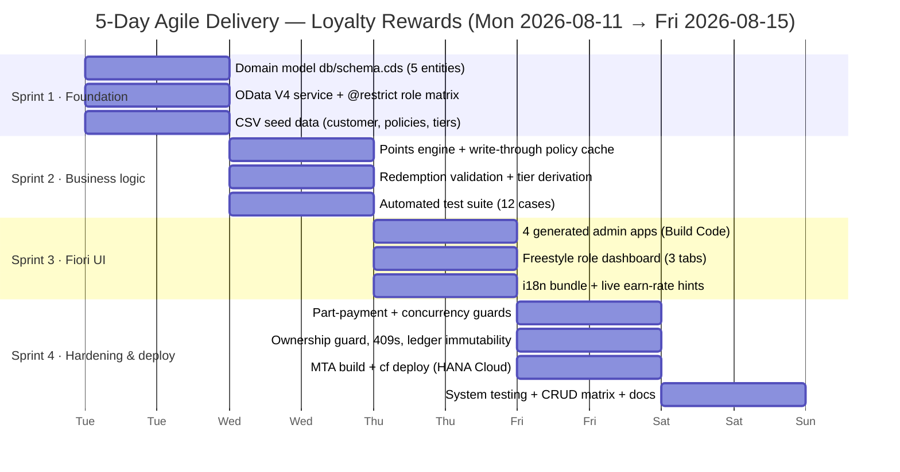
```mermaid
gantt
    title 5-Day Agile Delivery — Loyalty Rewards (Mon 2026-08-11 → Fri 2026-08-15)
    dateFormat YYYY-MM-DD
    axisFormat %a
    todayMarker off
    section Sprint 1 · Foundation
    Domain model db/schema.cds (5 entities)      :s1a, 2026-08-11, 1d
    OData V4 service + @restrict role matrix     :s1b, 2026-08-11, 1d
    CSV seed data (customer, policies, tiers)    :s1c, 2026-08-11, 1d
    section Sprint 2 · Business logic
    Points engine + write-through policy cache   :s2a, 2026-08-12, 1d
    Redemption validation + tier derivation      :s2b, 2026-08-12, 1d
    Automated test suite (12 cases)              :s2c, 2026-08-12, 1d
    section Sprint 3 · Fiori UI
    4 generated admin apps (Build Code)          :s3a, 2026-08-13, 1d
    Freestyle role dashboard (3 tabs)            :s3b, 2026-08-13, 1d
    i18n bundle + live earn-rate hints           :s3c, 2026-08-13, 1d
    section Sprint 4 · Hardening & deploy
    Part-payment + concurrency guards            :s4a, 2026-08-14, 1d
    Ownership guard, 409s, ledger immutability   :s4b, 2026-08-14, 1d
    MTA build + cf deploy (HANA Cloud)           :s4c, 2026-08-14, 1d
    System testing + CRUD matrix + docs          :s4d, 2026-08-15, 1d
```

**Figure 6.1 — deployment flow (Mermaid):**

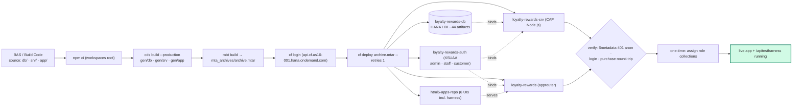
```mermaid
flowchart LR
    A["BAS / Build Code<br/>source: db/ · srv/ · app/"] --> B["npm ci (workspaces root)"]
    B --> C["cds build --production<br/>gen/db · gen/srv · gen/app"]
    C --> D["mbt build → mta_archives/archive.mtar"]
    D --> E["cf login (api.cf.us10-001.hana.ondemand.com)"]
    E --> F["cf deploy archive.mtar --retries 1"]
    F --> G[("loyalty-rewards-db<br/>HANA HDI · 44 artifacts")]
    F --> H["loyalty-rewards-srv (CAP Node.js)"]
    F --> I["loyalty-rewards (approuter)"]
    F --> J["loyalty-rewards-auth (XSUAA<br/>admin · staff · customer)"]
    F --> K["html5-apps-repo (6 UIs incl. harness)"]
    G -. binds .-> H
    J -. binds .-> H
    J -. binds .-> I
    K -. serves .-> I
    H --> V{"verify: $metadata 401 anon ·<br/>login · purchase round-trip"}
    I --> V
    V --> L["one-time: assign role collections"]
    L --> M["live app + /apitestharness running"]
    style M fill:#D1FAE5,stroke:#047857,stroke-width:2px
```

# Appendix C — Design-to-Code Trail

Three working documents from the design phase ship with the report as-is — sketch first, then the enforced version of the same decisions in the service:


*Figure C.1 — `Customer Reward Policy Flow` (design sketch): how a purchase flows through the channel policy to issued points, drawn before the handler code existed.*

- **`Customer Identity and Role` (PDF)** — the identity/role mapping worked out before coding; the `@restrict` matrix in Section 3.9 is its codified form.
- **`Loyalty Service — CRUD API Test Harness` (PDF)** — full printout of the deployed test page run, companion to Section 5.

Supporting documents in the repository: `docs/data-model.md` (spec→implementation conformance), `docs/sprint-plan.md`, `docs/test-cases.md`, `docs/crud-test-results.md` (all 38 executed cases with responses), `docs/deployment.md`, `docs/commands-reference.md` (every command with real output), `docs/build-code-prompts.md`, `docs/submission-document.md` (narrative version of this report).

# Appendix D — Project Structure

```
loyalty-rewards/
├── db/
│   ├── schema.cds              # domain model (Section 2)
│   ├── data/                   # CSV seeds: 1 customer, 2 policies, 3 thresholds
│   └── undeploy.json           # HDI teardown safety
├── srv/
│   ├── service.cds             # OData v4 service + @restrict matrix (Section 3.1)
│   ├── service.js              # getUserInfo, Customer CREATE validation/guards
│   ├── handlers/
│   │   ├── transaction.js      # points engine (Section 3.4)
│   │   ├── redemption.js       # redemption validation + deduction (3.5)
│   │   └── policy.js           # cache reload + tier recompute (3.6)
│   ├── lib/                    # policy-cache · tier · point-value · ownership · channels
│   └── ui-annotations.cds      # list columns, value helps for the generated apps
├── app/
│   ├── loyalty-dashboard/      # freestyle UI5 role dashboard (Section 7)
│   ├── customers-management/   # generated List Report/Object Page (Build Code)
│   ├── transactions-management/
│   ├── reward-policies/
│   ├── tier-thresholds-management/
│   ├── api-test-harness/       # deployed CRUD test page (Section 5.1)
│   └── router/                 # approuter config
├── test/loyalty.test.js        # 12 automated cases (Section 5.2)
├── mta.yaml                    # MTA: modules & resources (Section 6.4)
├── xs-security.json            # scopes, attributes, role templates
├── package.json                # profiles: dev/test (sqlite+basic) · prod (hana+xsuaa)
└── docs/                       # this report + supporting documents + screenshots
```
