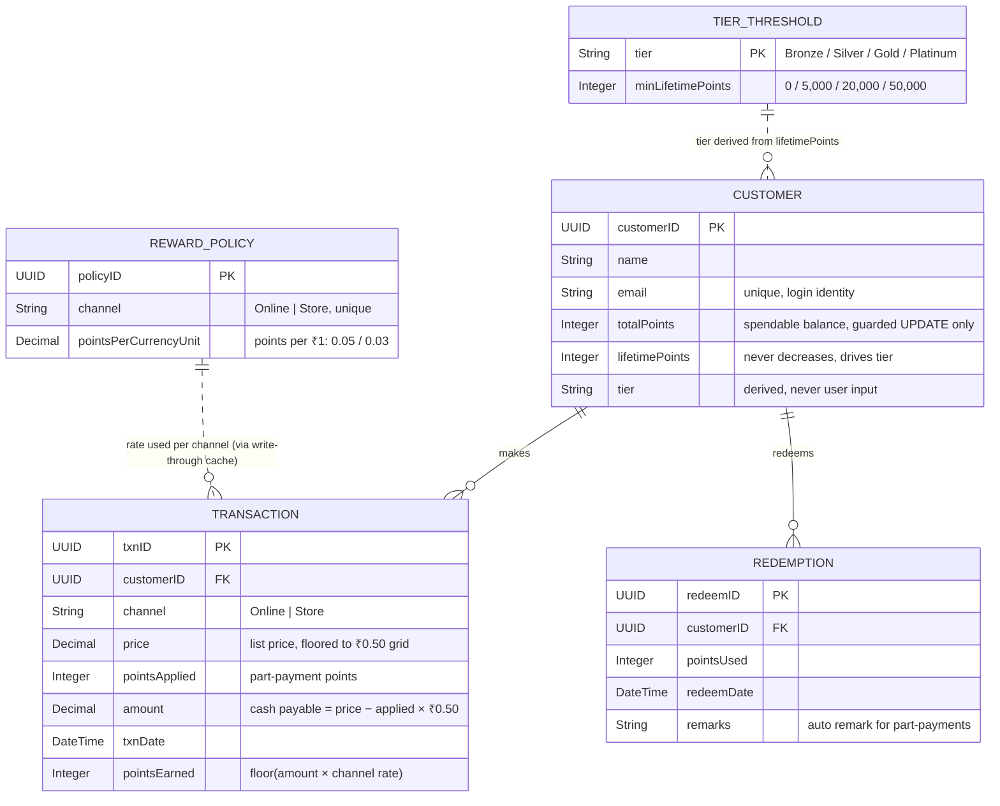

# Data Model / ER Diagram

Mermaid `erDiagram` source; renders on GitHub, VS Code (mermaid plugin), mermaid.live, and most markdown viewers. Attribute types as in `db/data-model.cds` (all entities also carry CAP `managed` fields: createdAt, createdBy, modifiedAt, modifiedBy).

Ready-made export: [er-diagram.png](er-diagram.png) (high resolution, drop straight
into Word or PDF).

Notes that the diagram cannot say by itself:

- `totalPoints` and `lifetimePoints` split spendable from historical: redeeming drops the first, never the second, so tiers never demote on redemption.
- `Transaction` and `Redemption` are an append-only ledger: the service rejects PATCH and DELETE for every role; balances only move through the guarded business handlers.
- Part-payments write both a Transaction (`pointsApplied` set) and an auto-generated Redemption row with remark `Applied to purchase (₹X → payable ₹Y)`, which is why the two entities share one audit trail.
- `RewardPolicy` and `TierThreshold` are configuration, not master data: one row per channel and one per tier, edited by admin only, read by the service through the write-through cache (never joined per purchase).
