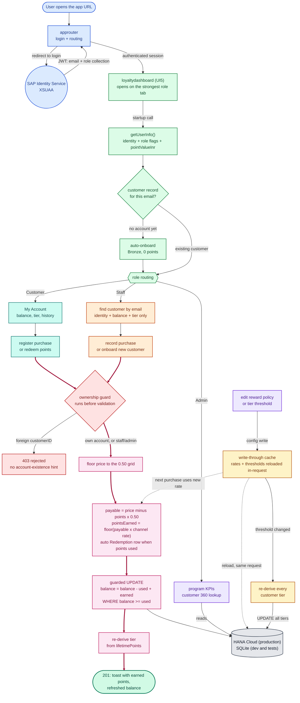

# High-Level Flow Diagram

Mermaid source with color-coded lanes: blue for the authentication edge, green for
the UI shell, teal for customer actions, orange for staff, purple for admin, red for
the ownership guard, pink for the purchase engine, amber for configuration, grey for
the database. The thick dark edges mark the money path. No icons or emoji, it stays
clean in print and in Word. Renders on GitHub and VS Code (mermaid plugin), or paste
into mermaid.live to export yourself.

Ready-made export of exactly this diagram: [flow-diagram.png](flow-diagram.png)
(rendered at high resolution, drop straight into Word or PDF).

How to read it: top to bottom. Every request is authenticated at the blue edge and
the UI learns who it is serving from the green startup call. The three role lanes
(teal, orange, purple) converge on the red ownership guard; anything that passes it
flows through the pink purchase engine in one database transaction, along the thick
dark edges. Amber is the only path that changes program rules, and it feeds the pink
engine through the write-through cache without a restart.
