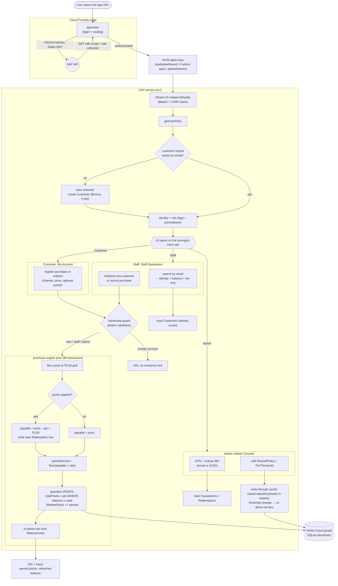

# High-Level Flow Diagram

Mermaid source; renders on GitHub, VS Code (with a mermaid plugin), mermaid.live, and most markdown viewers.

Reading it top to bottom: every request is authenticated at the edge; the UI learns who it is serving from `getUserInfo()`; all money-moving paths funnel through the same guarded purchase engine, and config edits take effect immediately through the write-through cache.
