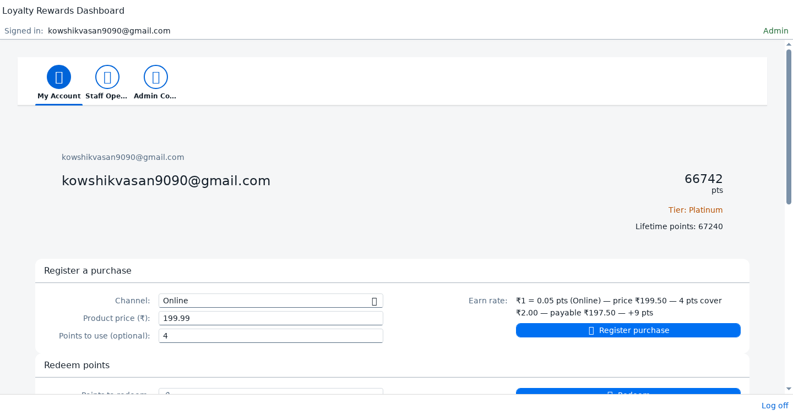
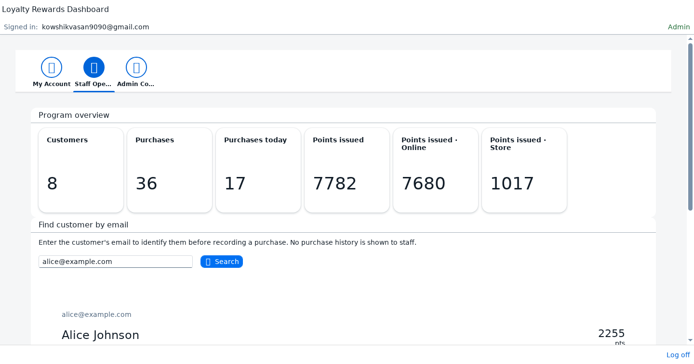
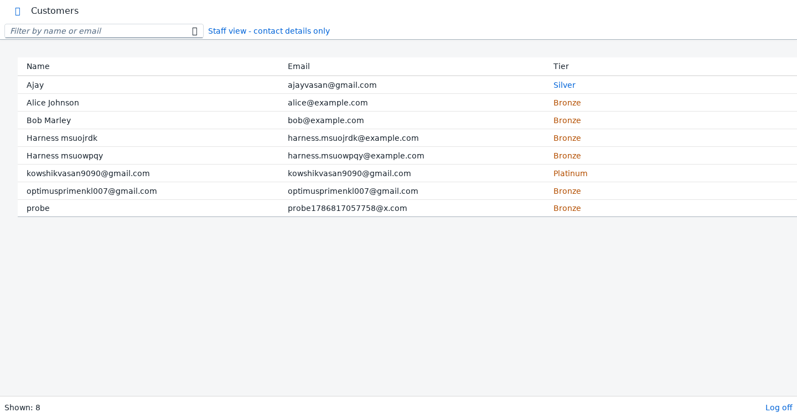
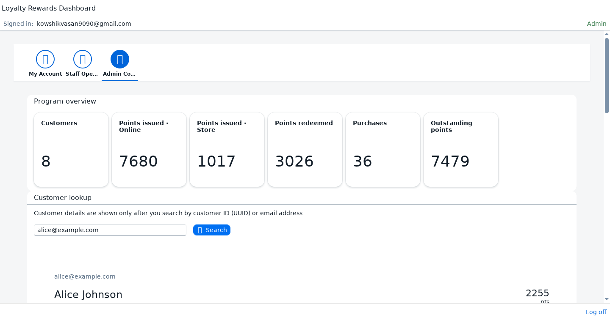
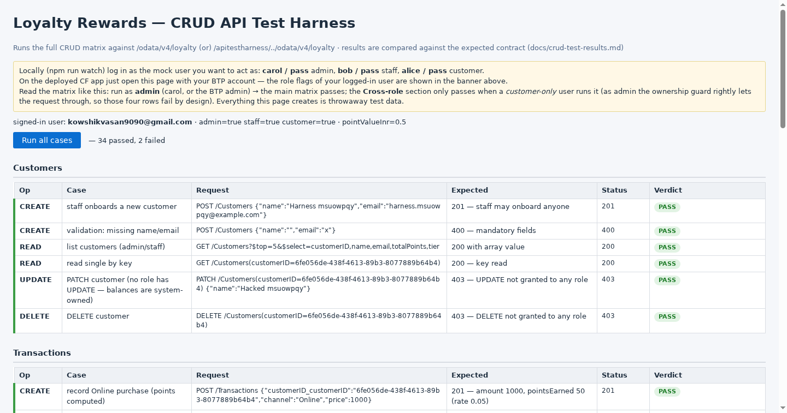

# Project Overview — Retail Omni-Channel Customer Loyalty & Rewards

This is the walk-through document for the loyalty system I built on SAP BTP with CAP
(Node.js) and Fiori UI5. It covers what the project is supposed to do, how I actually
built it sprint by sprint, and, most importantly, what the running application looks
like for each kind of user. Every screenshot below was taken from the deployed app on
Cloud Foundry, not from a local mock.

- Live app: https://9231c958trial-dev-loyalty-rewards.cfapps.us10-001.hana.ondemand.com/loyaltydashboard/index.html
- CRUD test page (submission requirement): https://9231c958trial-dev-loyalty-rewards.cfapps.us10-001.hana.ondemand.com/apitestharness/index.html
- Problem statement: [txt.md](../txt.md)

## What the project is about

A retailer sells through a website and through physical stores. Customers expect one
loyalty balance across both, so the system keeps a single customer record, records
purchases from either channel, converts the purchase value into points using an
admin-configurable rate per channel, and lets the customer spend those points later.
Online purchases earn more than store purchases (₹1 = 0.05 points online versus 0.03
in store by default) because the business wants to push digital adoption. That single
rule drives most of the interesting logic in the backend.

Three roles use the system. A customer looks after their own account: balance, tier,
purchase history, redemptions, and they can register a purchase themselves. Retail
staff serve customers at the counter: find the customer by email, record a purchase,
onboard someone new. An admin governs the program: reward policies, tier thresholds,
a full customer 360 lookup, and program level KPIs.

One decision worth calling out early: staff can see who a customer is, but not what
they bought. The staff search returns identity and the current balance (needed to
accept points as payment) and nothing else. Purchase history analysis belongs to the
admin role. I enforced this on the backend with `@restrict` grants, not just by hiding
UI elements, so the API refuses to hand out the data in the first place.

## How the pieces fit together

```
        browser
          │
   SAP approuter (XSUAA login, routes /loyaltydashboard, /apitestharness, ...)
          │
   ┌──────┴──────────────────────────────────────┐
   │  Fiori apps (html5 repo)                    │
   │  loyalty-dashboard (freestyle, all roles)   │
   │  4 generated admin apps (List Report/OPage) │
   │  apitestharness (static CRUD test page)     │
   └──────┬──────────────────────────────────────┘
          │  OData V4 ($batch, CSRF)
   LoyaltyService  /odata/v4/loyalty      srv/service.cds
          │  handlers: transaction, redemption, policy
          │  libs: policy-cache, tier, channels, point-value, ownership
   ┌──────┴──────────┐
   │ SQLite (local)  │   in-memory for dev and tests
   │ SAP HANA Cloud  │   production, HDI container, deployed by mta
   └─────────────────┘
```

The service is one CAP service with five entities. Customers, Transactions and
Redemptions come straight from the spec. I added RewardPolicy and TierThreshold as
configuration entities because the admin role in the spec explicitly needs to modify
earn rates and tier rules without a code change. Two more columns on Transaction,
`price` and `pointsApplied`, carry the part-payment feature (a later requirement):
`amount` stays in the model as the cash the customer actually pays, which is what the
spec's amount field always meant.

## The point engine, with real numbers

Everything a purchase does happens inside one CREATE handler and one database
transaction, so a half-recorded purchase cannot exist.

Worked example from the deployed system. Staff records a product priced ₹75.30 for
Alice, and she wants to use 6 points.

1. The price is floored to the ₹0.50 grid, so ₹75.30 becomes ₹75.00. This is why the
   payable never shows an odd fraction like ₹72.37: one point covers exactly ₹0.50,
   so both the price side and the discount side stay on the grid.
2. 6 points × ₹0.50 = ₹3.00 covered. Payable = ₹72.00.
3. Points are earned on what was actually paid: floor(72 × 0.05) = 3 points.
4. A Redemption row is written automatically ("Applied to purchase (₹75 → payable
   ₹72)"), so part-payments and normal redemptions share one audit trail.
5. Alice's balance moves 2248 → 2245 in a single guarded SQL UPDATE
   (`totalPoints = totalPoints − 6 + 3 WHERE totalPoints >= 6`). Two purchases at the
   same instant cannot spend the same points twice; the loser's UPDATE matches zero
   rows and gets a clean 400 asking them to retry. There is a test that fires two
   full-balance redemptions in parallel and asserts exactly one succeeds.

Tiers use lifetimePoints (which never drops) rather than the spendable balance, so
redeeming points never demotes a customer. When an admin edits a threshold, every
existing customer's tier is re-derived on the spot.

## The running app, role by role

### Customer: My Account



First login creates the loyalty account automatically (name and email come from the
login, tier starts at Bronze with zero points) and says welcome. After that the tab
shows the balance, tier and lifetime points up top, then the two forms and the two
history tables.

The purchase form is where the part-payment requirement lives. The customer picks a
channel, types the price, and can optionally put points in. The grey hint line under
the form recalculates on every keystroke. In the screenshot it reads
`₹1 = 0.05 pts (Online) — price ₹199.50 — 4 pts cover ₹2.00 — payable ₹197.50 — +9 pts`,
which is the whole computation made visible before anything is submitted. The points
field is clamped live to what the balance and the price actually allow, so typing 999
into it just snaps back to the maximum.

The redeem form below it spends points without a purchase, with an optional remark.
Both history tables show what happened, including a red "Points used" column on
purchases that were part-paid with points.

### Retail staff: Staff Operations



Staff land on their own tab (the app picks the default tab from the strongest role of
the logged-in user). The KPI strip across the top is deliberately their working day:
how many customers exist, how many purchases total, and how many purchases today,
plus points issued split by channel. Below that, the find panel. Staff type an email,
press search, and get a card with name, current balance and tier. That balance matters
operationally: it is the ceiling for points the customer can spend in the next field.

The screenshot has the flow mid-story: Alice found (2,245 pts, Bronze), a ₹75.30
purchase with 6 points applied, and the same live hint the customer sees. Submit and
the toast confirms "3 points earned by Alice Johnson", the card's balance refreshes,
and the KPI tiles update. The "Add new customer" panel onboards someone on the spot
and selects them for the purchase form. The "Customer directory" button opens a plain
contact list (name, email, tier) with no drill-down, because staff do not get history.



### Admin: Admin Console



The admin strip answers program-level questions: customers, purchases, points issued
per channel, points redeemed, and outstanding points, which is the sum of all live
balances. That last one is the program's open liability and it reconciles: issued
minus redeemed equals outstanding (68,932 = 69,549 − 558 in the screenshot's data).

Nothing about an individual customer is shown until the admin actively looks someone
up, by email or by UUID. The lookup opens the full 360: identity, balances, tier, the
complete purchase table (price, payable, points applied, points earned per row) and
every redemption including the automatic part-payment rows. Reward policies and tier
thresholds are editable inline on the same tab; saving a rate reloads the server-side
policy cache immediately, and saving a threshold re-derives everyone's tier. Duplicate
policies (one per channel is the rule) come back as a clean 409 rather than a database
error.

### The CRUD test page



The submission asks for a runnable demonstration of CRUD on the service, so I built a
self-contained test page and deployed it with the app (it is plain HTML and fetch, no
framework, about 280 lines). Pressing "Run all cases" executes 36 requests against the
live OData service: creates, reads with filters and `$apply` aggregates, updates and
deletes on every entity, plus the function import, and checks each response against
the expected contract. The banner shows who you are logged in as, including the
server-provided point value of ₹0.50.

In the screenshot the run is as the BTP admin: 34 of 36 pass. The two red rows are
the cross-role cases ("customer buys for a foreign account" and "customer redeems a
foreign account") which are supposed to return 403 for a customer-only login; as
admin the ownership guard correctly lets them through, so they show 201. Run the same
page locally with the mock customer user and those two flip to green while the
admin-only rows flip red. The full expected-versus-actual matrix is written down in
[crud-test-results.md](crud-test-results.md) (38 cases recorded locally, 38/38).

The page also documents the negative-space rules by testing them: transactions and
redemptions refuse PATCH and DELETE with 403 for everyone, because they are an
immutable ledger. Customers cannot be PATCHed or DELETEd by anyone either; balances
only move through the validated business paths.

## How the build actually went (sprint log)

Sprint 1 was the model and service. Entities, associations, seed CSVs (two policies,
three thresholds, one customer), the OData V4 exposure and the role matrix in
`srv/service.cds`. I kept the grants tight from the start: admin everything, staff
read-and-record, customers self-service scoped to their own rows.

Sprint 2 was the logic. The points computation with a cached policy store (refreshed
whenever a policy or threshold changes), redemption validation, tier derivation, and
the guarded balance UPDATEs. The automated suite (`npm test`, 12 cases) grew alongside
the logic rather than after it, which caught the tier-recompute-on-threshold-change
behaviour more than once.

Sprint 3 was UI. Four List Report / Object Page apps generated with Build Code for
admin CRUD, then the freestyle dashboard for all three roles, which is where most of
the UI5 v4 learning happened. Two things cost me an evening each: inactive create
contexts in OData V4 (a `list.create(data, ..., true)` looks fine and silently never
sends), and surfacing backend errors that arrive inside a `$batch` envelope, which
only show up through the message manager. The `_send` helper in the dashboard
controller is the distilled fix for both.

Sprint 4 was hardening and deployment. The concurrency guard, the ownership guards
running before validation (so a foreign customerID cannot be used to probe whether an
account exists), input validation on customer creation, the 409s, and the deploy to
Cloud Foundry with HANA Cloud behind it. One review bug fixed late: users holding
both admin and staff roles only ever got the admin KPI strip filled; now both strips
load in parallel.

The prompts I fed to Build Code and Joule while building all of this are logged in
[build-code-prompts.md](build-code-prompts.md) (the four UI generation prompts are
also in [prompts.md](../prompts.md) verbatim), and the commands I ran with their real
outputs are in [commands-reference.md](commands-reference.md).

## Deliverables checklist

| Required by txt.md | Where |
|---|---|
| Project Overview Document | this file |
| Data Model Design | [data-model.md](data-model.md), spec attribute by attribute |
| Service Definition (.cds) | `srv/service.cds` (summarised in readme) |
| Agile Sprint Plan | [sprint-plan.md](sprint-plan.md), user stories with acceptance criteria |
| Test Case Sheet | [test-cases.md](test-cases.md) (automated + manual) |
| Deployment Steps | [deployment.md](deployment.md) |
| Build Code prompts | [build-code-prompts.md](build-code-prompts.md), [prompts.md](../prompts.md) |
| Executed application output | live links at the top; screenshots above |
| CRUD test file (html) | `app/api-test-harness/webapp/index.html`, deployed at /apitestharness/index.html |

## Running and checking it yourself

Locally: `npm install`, `npm run watch`, then log in as alice (customer), bob (staff)
or carol (admin), password `pass`, all against a disposable in-memory database.
Tests: `npm test`. Deploy: `npm run build && npm run deploy`, which is `mbt build`
plus `cf deploy` of the generated archive; the full sequence with outputs is in
[deployment.md](deployment.md).
